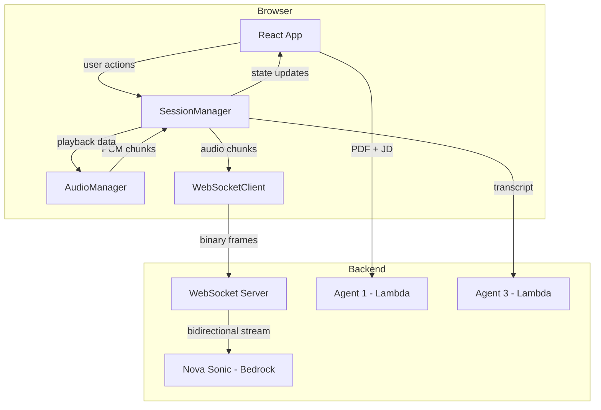
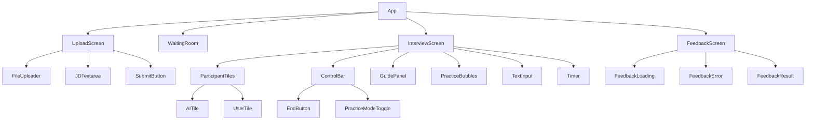
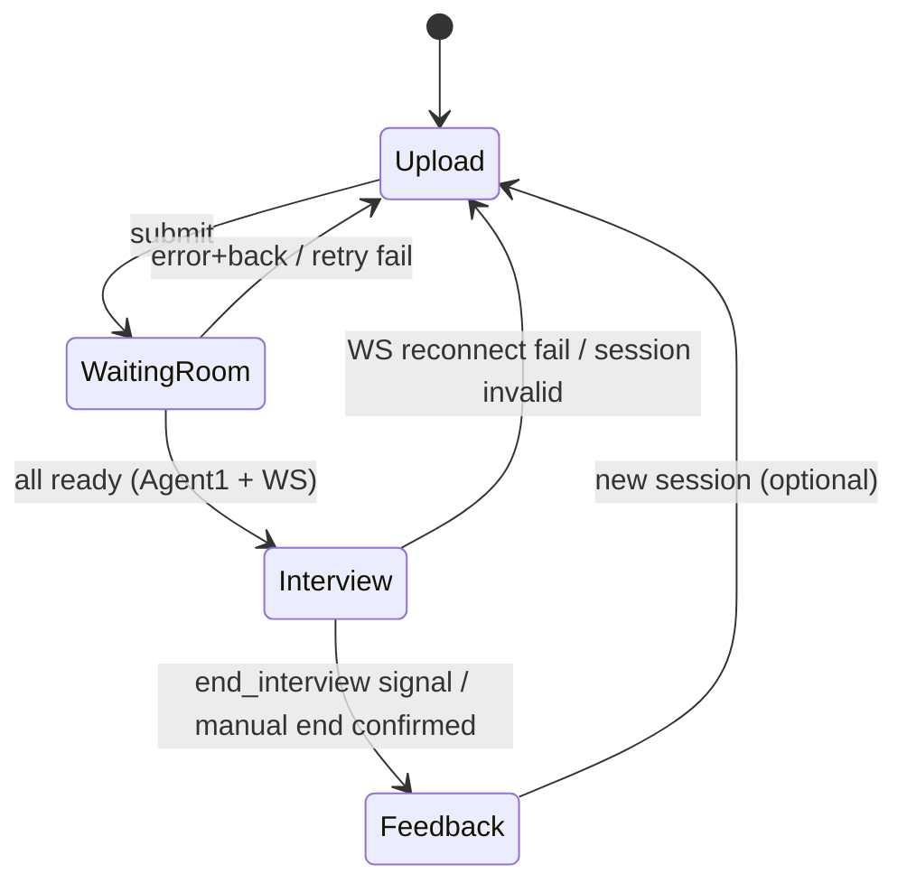
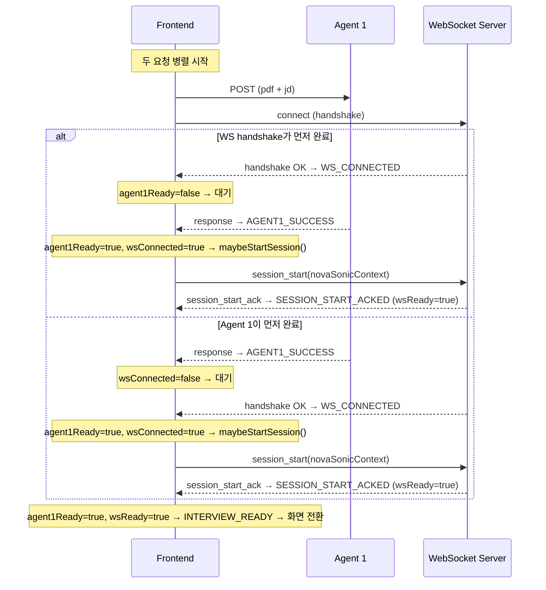

# Design Document — Frontend Interview

## Overview

본 설계는 AI Mock Interview Coach 프론트엔드의 Upload Screen과 Interview Screen을 다룬다. 사용자가 이력서(PDF)와 JD를 제출하면 Agent 1이 분석하고, WebSocket Server를 통해 Amazon Nova Sonic과 실시간 음성 인터뷰를 진행하는 SPA(Single Page Application)다.

핵심 기술 결정:
- **프레임워크**: React + TypeScript (기존 프로젝트 Lambda 구조와 독립적인 정적 배포)
- **상태관리**: React Context + useReducer (전역 상태: session, transcript, interview status)
- **오디오 처리**: Web Audio API + AudioWorklet (저지연 마이크 캡처 및 재생)
- **통신**: 단일 WebSocket 연결 (Nova Sonic ↔ WebSocket Server ↔ Browser)
- **빌드**: Vite (빠른 개발 서버, 정적 배포)

---

## Architecture

### 시스템 아키텍처



### 컴포넌트 계층



### 화면 전환 흐름



### 데이터 흐름

1. **Upload → Waiting Room**: PDF(base64) + JD text → Agent 1 HTTP POST (동시에 WebSocket handshake 시작)
2. **Waiting Room → Interview**: 아래 두 조건이 모두 충족되어야 전환:
   - `agent1Ready = true`: Agent 1 응답(`nova_sonic_context`, `competency_guides`) 수신 완료
   - `wsReady = true`: WebSocket handshake 완료 후, `session_start` 이벤트 전송 + 서버 ack 수신 완료
   - **`session_start` 전송 타이밍**: Agent 1 응답에 포함된 `novaSonicContext`가 `session_start` payload에 필요하므로, `session_start`는 `agent1Ready = true`가 된 시점에 트리거된다. 즉, WS handshake는 Agent 1과 병렬로 미리 완료될 수 있지만, `session_start` 전송은 Agent 1 완료 이후에만 가능하다.
   - **흐름**: WS handshake 성공 → (Agent 1 대기) → Agent 1 완료 → `session_start` 전송 → 서버 ack → `wsReady = true` → 인터뷰 전환
3. **Interview (음성 루프)**:
   - 마이크 → AudioWorklet → PCM 16-bit 16kHz → WebSocket → Nova Sonic
   - Nova Sonic → WebSocket → PCM 16-bit 24kHz → AudioContext playback
   - Nova Sonic → WebSocket → 텍스트 이벤트 (interviewer/user ASR) → transcript 누적
4. **Interview → Feedback**: 종료 즉시 피드백 화면 전환 → 누적 transcript HTTP POST → Agent 3 → 로딩 중 표시 → 결과 표시

---

## Components and Interfaces

### 1. AudioManager

마이크 캡처와 오디오 재생을 담당하는 핵심 모듈.

```typescript
interface AudioManagerConfig {
  inputSampleRate: 16000;
  outputSampleRate: 24000;
  channelCount: 1;
  sampleSizeBits: 16;
  frameSize: 512; // ~32ms at 16kHz
}

interface AudioManager {
  // Lifecycle
  initialize(): Promise<{ granted: boolean }>;
  destroy(): void;

  // Capture
  startCapture(): void;
  pauseCapture(): void;   // 텍스트 입력 중 호출
  resumeCapture(): void;  // 텍스트 제출 완료 후 호출

  // Playback
  enqueueAudio(pcmBase64: string): void;
  stopPlayback(): void;       // barge-in: 즉시 정지 + queue clear
  isPlaying(): boolean;
  waitForPlaybackEnd(): Promise<void>;  // 자동 종료 시 마지막 오디오 재생 완료 대기

  // Events
  onAudioChunk: (chunk: ArrayBuffer) => void;
  onPlaybackEnd: () => void;
}
```

**구현 상세:**
- `AudioWorkletNode`로 마이크 입력을 처리 (메인 스레드 블로킹 방지)
- Input: 16kHz, 16-bit PCM, mono — Nova Sonic 입력 요구사항
- Output: 24kHz, 16-bit PCM, mono — Nova Sonic 출력 포맷
- 에코 캔슬레이션: `MediaStreamConstraints`의 `echoCancellation: true` + `noiseSuppression: true`
- Playback queue: `AudioBufferSourceNode` 체인으로 gap-free 재생
- `pauseCapture()` 구현: AudioWorklet에 메시지를 보내 캡처된 프레임의 WebSocket 전송을 중지 (캡처 자체는 유지하여 AudioContext suspend/resume 오버헤드 방지)

### 2. WebSocketClient

WebSocket Server와의 통신을 관리하는 모듈.

```typescript
interface WebSocketClientConfig {
  url: string;
  maxReconnectAttempts: 2;
  reconnectDelayMs: [1000, 2000]; // exponential backoff
}

interface WebSocketClient {
  // Connection
  connect(config: WebSocketClientConfig): Promise<void>;
  disconnect(): void;
  getState(): 'connecting' | 'connected' | 'reconnecting' | 'disconnected';

  // Messaging
  send(message: WebSocketMessage): void;
  sendSessionStart(novaSonicContext: string, inferenceConfig: object): Promise<void>; // ack 수신까지 대기
  sendAudioChunk(pcmBase64: string, promptName: string, contentName: string): void;
  sendTextInput(text: string, promptName: string, contentName: string): void;

  // Events
  onMessage: (event: NovaSonicOutputEvent) => void;
  onDisconnect: (reason: string) => void;
  onReconnectAttempt: (attempt: number) => void;
  onReconnectSuccess: () => void;
  onReconnectFailed: () => void;
  onSessionInvalid: () => void; // 서버가 세션 만료를 알릴 때
}
```

**재연결 전략:**
1. 연결 끊김 감지 시 1초 후 첫 번째 재연결 시도
2. 첫 번째 실패 시 2초 후 두 번째 시도 (exponential backoff)
3. 재연결 성공 시: 기존 세션 유지 전제 (백엔드 의존), transcript/state 보존
4. 서버가 `session_invalid` 응답 반환 시: `onSessionInvalid` → 에러 메시지 + 업로드 화면 복귀 옵션
5. 두 번째 실패 시: `onReconnectFailed` → 에러 메시지 + 업로드 화면 복귀 옵션

### 3. SessionManager

인터뷰 세션의 전체 상태를 관리하는 중앙 오케스트레이터.

```typescript
type InterviewPhase = 'upload' | 'waiting' | 'interview' | 'feedback';
type TurnState = 'ai_speaking' | 'user_turn' | 'idle';
type InputMode = 'voice' | 'text_only';
type TextInputState = 'idle' | 'composing'; // idle: 입력창 비어있음, composing: 텍스트 있음

interface SessionState {
  phase: InterviewPhase;
  turnState: TurnState;
  inputMode: InputMode;
  textInputState: TextInputState;
  practiceMode: boolean;
  transcript: TranscriptEntry[];
  competencyGuides: CompetencyGuide[];
  novaSonicContext: string;
  elapsedSeconds: number;
  wsConnectionState: 'connecting' | 'connected' | 'reconnecting' | 'disconnected';
  // Waiting room partial success tracking
  agent1Ready: boolean;  // Agent 1 응답 수신 완료
  wsReady: boolean;      // WS handshake + session_start 전송 + 서버 ack 수신 완료 (단순 handshake 아님)
  error: SessionError | null;
}

interface TranscriptEntry {
  role: 'interviewer' | 'user';
  text: string;
  timestamp: string; // ISO 8601, 프론트 수신 시점 로컬 시간
}

interface CompetencyGuide {
  id: string;
  title: string;
  keywords: string[];
  description: string;
  highlighted: boolean;
}

interface SessionError {
  code: 'AGENT1_FAILED' | 'WS_CONNECT_FAILED' | 'WS_RECONNECT_FAILED'
      | 'WS_SESSION_INVALID' | 'TIMEOUT' | 'MIC_DENIED' | 'AGENT3_FAILED'
      | 'FILE_INVALID';
  message: string;
  retryable: boolean;
}
```

### 3-1. session_start 트리거 조율 로직

Agent 1 호출과 WS handshake는 병렬로 시작되므로 어느 쪽이 먼저 끝날지 비결정적이다. `sendSessionStart()`는 **양쪽 모두 완료된 시점**에서 정확히 1회만 호출되어야 한다.

```typescript
// 의사코드 — reducer side effect 또는 middleware에서 처리
function maybeStartSession(state: SessionState, ws: WebSocketClient) {
  // 두 조건이 모두 만족되었을 때만 session_start 전송
  if (state.agent1Ready && state.wsConnectionState === 'connected' && !state.wsReady) {
    ws.sendSessionStart(state.novaSonicContext, inferenceConfig)
      .then(() => dispatch({ type: 'SESSION_START_ACKED' }))
      .catch(() => dispatch({ type: 'WS_CONNECT_FAILED', ... }));
  }
}

// 호출 지점 1: Agent 1이 나중에 완료되는 경우
function handleAgent1Success(payload: Agent1Response) {
  dispatch({ type: 'AGENT1_SUCCESS', payload });
  // WS가 이미 connected 상태인지 확인 후 session_start 트리거
  maybeStartSession(getState(), ws);
}

// 호출 지점 2: WS handshake가 나중에 완료되는 경우
function handleWsConnected() {
  dispatch({ type: 'WS_CONNECTED' });
  // Agent 1이 이미 success 상태인지 확인 후 session_start 트리거
  maybeStartSession(getState(), ws);
}
```

**핵심 불변량**: `sendSessionStart()`는 `agent1Ready === true && wsConnectionState === 'connected' && wsReady === false`인 상태에서만 호출된다. 어느 한쪽 핸들러에만 구현하면 특정 완료 순서에서 세션이 시작되지 않는 버그가 발생한다.



### 4. GuidePanel — 키워드 매칭 알고리즘

```typescript
interface KeywordMatcher {
  /**
   * interviewer 텍스트에서 competency keywords를 매칭하여
   * 관련된 guide 항목들의 ID를 반환한다.
   *
   * 알고리즘:
   * 1. interviewer 텍스트를 정규화 (소문자 변환, 특수문자 제거)
   * 2. 각 CompetencyGuide의 keywords를 순회
   * 3. keyword가 텍스트 내에 존재하면 매칭
   * 4. 매칭된 guide ID 목록 반환
   */
  matchKeywords(text: string, guides: CompetencyGuide[]): string[];
}
```

**매칭 알고리즘 상세:**
- Case-insensitive substring match
- 한글 키워드: 공백 기준 토큰 비교 (형태소 분석 없이 단순 포함 여부)
- 영문 키워드: word boundary 고려한 정규식 매칭 (`\b{keyword}\b`)
- 매칭 결과가 변경될 때만 re-render (이전 결과와 shallow compare)
- Practice Mode OFF 전환 시: 모든 highlighted를 false로 즉시 리셋

### 5. 주요 React 컴포넌트 인터페이스

```typescript
// UploadScreen
interface UploadScreenProps {
  onSubmit: (pdf: File, jdText: string) => void;
}

// WaitingRoom
interface WaitingRoomProps {
  agent1Ready: boolean;
  wsReady: boolean;
  error: SessionError | null;
  onRetry: (target: 'agent1' | 'ws' | 'both') => void; // 실패 항목만 재시도
  onBack: () => void; // 업로드 화면 복귀
  timeoutMs: 30000;
}

// InterviewScreen
interface InterviewScreenProps {
  sessionState: SessionState;
  onEnd: () => void;
  onTogglePracticeMode: () => void;
  onTextSubmit: (text: string) => void;
}

// GuidePanel
interface GuidePanelProps {
  guides: CompetencyGuide[];
  practiceMode: boolean;
  currentInterviewerText: string | null;
}

// ParticipantTile
interface ParticipantTileProps {
  label: string;
  isActive: boolean; // 웨이브폼 활성화 여부
  showWaveform: boolean;
}

// FeedbackScreen
interface FeedbackScreenProps {
  loading: boolean;
  error: SessionError | null;
  onRetry: () => void;       // 동일 transcript로 Agent 3 재요청
  onNewSession: () => void;  // 업로드 화면으로
}

// EndConfirmModal
interface EndConfirmModalProps {
  open: boolean;
  onConfirm: () => void;
  onCancel: () => void;
}
```

---

## Data Models

### Nova Sonic 통신 프로토콜

**Frontend → WebSocket Server (Input Events):**

| Event | Purpose | Payload |
|-------|---------|---------|
| `session_start` | 세션 초기화 | `{ novaSonicContext, inferenceConfig }` |
| `audio_chunk` | 마이크 PCM 데이터 | `{ content: base64, promptName, contentName }` |
| `text_input` | 텍스트 답변 전송 | `{ content: string, promptName, contentName }` |
| `session_end` | 세션 종료 요청 | `{ promptName }` |

**WebSocket Server → Frontend (Output Events):**

| Event | Purpose | Payload |
|-------|---------|---------|
| `session_start_ack` | 세션 초기화 완료 확인 | `{ sessionId: string }` |
| `audio_output` | AI 음성 응답 | `{ content: base64, contentId }` |
| `text_output` | 텍스트 transcript | `{ content: string, role: 'interviewer' \| 'user', generationStage: 'PARTIAL' \| 'FINAL' }` |
| `tool_use` | 도구 호출 (e.g., `end_interview`) | `{ toolName, toolUseId, content }` |
| `content_end` | 콘텐츠 블록 종료 | `{ contentId, stopReason }` |
| `completion_end` | 응답 완료 | `{ completionId, stopReason }` |
| `interrupted` | Barge-in 감지 | `{ contentId }` |
| `session_invalid` | 세션 만료/무효 | `{ reason: string }` |

**텍스트 이벤트 처리 규칙:**
- `generationStage: 'FINAL'`인 `text_output`만 transcript에 누적 (PARTIAL은 UI 표시용으로만 사용 가능)
- `role` 필드로 interviewer/user 구분 — 프론트가 별도로 판단하지 않음
- 텍스트 fallback 답변(Req 3.8)도 서버가 `text_output`으로 에코해주는 것을 전제로 함

### 오디오 스트리밍 사양

| Parameter | Input (Mic → Server) | Output (Server → Speaker) |
|-----------|---------------------|--------------------------|
| Codec | Linear PCM (LPCM) | Linear PCM (LPCM) |
| Sample Rate | 16,000 Hz | 24,000 Hz |
| Bit Depth | 16-bit signed int | 16-bit signed int |
| Channels | 1 (mono) | 1 (mono) |
| Frame Duration | ~32ms | varies |
| Frame Size | 512 samples (1024 bytes) | variable |
| Encoding | base64 over WebSocket text frames | base64 over WebSocket text frames |

### Agent 1 응답 스키마

```typescript
interface Agent1Response {
  nova_sonic_context: string;      // Nova Sonic system prompt에 주입할 컨텍스트
  competency_guides: CompetencyGuide[];
}
```

### Agent 3 요청 스키마

```typescript
interface Agent3Request {
  transcript: TranscriptEntry[];  // { role, text, timestamp }[]
  competency_guides: CompetencyGuide[]; // 참고용 전달
}
```

### 프론트엔드 상태 스키마 (useReducer)

```typescript
type SessionAction =
  | { type: 'SUBMIT_UPLOAD'; payload: { pdf: File; jdText: string } }
  | { type: 'AGENT1_SUCCESS'; payload: Agent1Response }
  | { type: 'AGENT1_FAILED'; payload: { message: string } }
  | { type: 'WS_CONNECTED' }           // handshake 완료 (wsReady는 아직 false)
  | { type: 'SESSION_START_ACKED' }    // session_start 전송 + ack 수신 → wsReady = true
  | { type: 'WS_DISCONNECTED'; payload: { reason: string } }
  | { type: 'WS_RECONNECT_SUCCESS' }
  | { type: 'WS_RECONNECT_FAILED' }
  | { type: 'WS_SESSION_INVALID' }
  | { type: 'INTERVIEW_READY' }
  | { type: 'AI_SPEAKING' }
  | { type: 'USER_TURN' }
  | { type: 'BARGE_IN' }
  | { type: 'APPEND_TRANSCRIPT'; payload: TranscriptEntry }
  | { type: 'TOGGLE_PRACTICE_MODE' }
  | { type: 'TEXT_INPUT_START' }  // 첫 글자 입력 시
  | { type: 'TEXT_INPUT_CLEAR' }  // 텍스트 제출 완료 또는 입력창 비워짐
  | { type: 'END_INTERVIEW'; payload: { reason: 'auto' | 'manual' } }
  | { type: 'AGENT3_LOADING' }
  | { type: 'AGENT3_SUCCESS'; payload: any }  // 피드백 결과 (스키마 TBD)
  | { type: 'AGENT3_FAILED'; payload: { message: string } }
  | { type: 'TIMEOUT' }
  | { type: 'TICK' }
  | { type: 'RESET' };  // 업로드 화면으로 복귀 시 전체 초기화
```

---

## Barge-in 처리 설계

**감지 주체**: 서버(Nova Sonic)가 barge-in을 감지하고 `interrupted` 이벤트를 전송. 프론트는 자체 VAD를 수행하지 않는다.

**프론트 동작**:
1. `interrupted` 이벤트 수신
2. `AudioManager.stopPlayback()` 호출 — 현재 재생 즉시 정지 + queue clear
3. `turnState`를 `'user_turn'`으로 전환
4. 웨이브폼 애니메이션 비활성화 (AI tile), 활성화 (User tile)

**네트워크 지연 인지**:
- 서버 감지 → 이벤트 전송 → 프론트 수신까지 지연이 있을 수 있음 (best-effort)
- 지연이 체감될 경우 향후 로컬 VAD 보조 감지를 추가할 수 있음 (현 MVP에서는 미구현)
- 로컬 VAD 추가 시: 로컬 감지로 먼저 오디오 정지 → 서버 `interrupted` 이벤트로 최종 확인 (optimistic approach)

---

## 텍스트 입력과 음성의 동시 제어

**요구사항 (Req 3.7)**: 텍스트 입력창에 텍스트가 입력되어 있는 동안 마이크 입력이 interviewer에게 전달되지 않아야 한다.

**구현 설계**:
- 트리거 조건: `textInputState === 'composing'` (첫 글자 입력 시점)
- 해제 조건: 텍스트 제출 완료 또는 입력창이 완전히 비워졌을 때
- 동작: `AudioManager.pauseCapture()` — AudioWorklet에서 캡처된 프레임의 전송을 중지 (캡처 자체는 유지)
- 이유: AudioContext를 suspend/resume하면 재개 시 glitch가 발생할 수 있으므로, 전송만 막는 방식 채택

---

## 인터뷰 종료 흐름

### 자동 종료 (end_interview tool 수신)

1. `tool_use` 이벤트 수신 (`toolName === 'end_interview'`)
2. `AudioManager.waitForPlaybackEnd()` — 현재 재생 중인 마지막 오디오 완료 대기
3. WebSocket `session_end` 전송 → 연결 종료
4. 화면을 즉시 Feedback으로 전환 (로딩 상태)
5. transcript를 Agent 3에 HTTP POST
6. 응답 대기 → 성공 시 결과 표시 / 실패 시 에러 + 재시도

### 수동 종료 (사용자 종료 버튼)

1. 종료 버튼 클릭 → 확인 모달 표시
2. 확인 시: 재생 중인 오디오 즉시 정지 (사용자 의도적 종료이므로 대기 불필요)
3. WebSocket `session_end` 전송 → 연결 종료
4. 화면을 즉시 Feedback으로 전환 (로딩 상태)
5. transcript를 Agent 3에 HTTP POST
6. 응답 대기 → 성공 시 결과 표시 / 실패 시 에러 + 재시도

### Agent 3 실패 처리

- 피드백 화면에서 에러 상태를 표시하고 "재시도" 버튼 제공
- 재시도 시 동일 transcript로 재요청
- 자동으로 빈 결과나 "평가 대기 중"으로 넘어가지 않음
- transcript는 메모리에 보관 유지 (재시도를 위해)

---

## 페이지 이탈 방지

**요구사항 (Req 3.15)**: 인터뷰 진행 중 새로고침/탭 닫기 시 `beforeunload` 경고 표시.

**구현**:
```typescript
useEffect(() => {
  if (phase === 'interview') {
    const handler = (e: BeforeUnloadEvent) => {
      e.preventDefault();
      e.returnValue = ''; // 브라우저 기본 경고 표시
    };
    window.addEventListener('beforeunload', handler);
    return () => window.removeEventListener('beforeunload', handler);
  }
}, [phase]);
```

- `phase === 'interview'`인 동안에만 활성화
- 피드백 화면 전환 후에는 자동 해제
- 브라우저 기본 경고 메시지 사용 (커스텀 메시지는 대부분의 브라우저에서 무시됨)

---

## 대기실 (Waiting Room) 상세 설계

### 병렬 요청 및 부분 재시도

```typescript
// 두 요청을 병렬로 시작
const [agent1Promise, wsHandshakePromise] = [
  callAgent1(pdf, jdText),
  connectWebSocket(wsUrl)  // handshake만 완료, session_start는 아직 안 보냄
];

// Agent 1 완료 시점에 session_start 전송
// agent1Ready = true → sendSessionStart(novaSonicContext) → 서버 ack 대기 → wsReady = true
// WS handshake가 Agent 1보다 먼저 끝나도, session_start는 Agent 1 완료 후에만 전송
```

**재시도 로직**:
- Agent 1 실패 + WS handshake 성공: Agent 1만 재시도, WS 연결 유지. Agent 1 성공 시 `maybeStartSession()` 트리거.
- WS 실패 + Agent 1 성공: WS만 재연결 (handshake). handshake 성공 시 캐시된 `novaSonicContext`로 `session_start`도 재전송 → ack 대기 → `wsReady = true`. (Agent 1을 다시 호출하지 않음)
- 둘 다 실패: 둘 다 재시도. 위 두 경로의 조합.

**타임아웃**: 30초 (Waiting Room 진입 시점부터 카운트). 이 30초는 아래 두 단계의 합산 시간을 포함한다:
- **Agent 1 응답** + **WS handshake** (병렬이므로 둘 중 긴 쪽이 기준)
- **session_start 전송 + 서버 ack 왕복** (Agent 1 완료 이후 순차 발생)

`session_start`가 Agent 1 완료 이후에 순차적으로 일어나는 구조이므로, 최악의 경우 "Agent 1 응답 시간 + session_start ack 왕복 시간"의 합이 30초 내에 완료되어야 한다.

**권장 시간 배분 (30초 budget)**:
| 단계 | 권장 최대 | 비고 |
|------|----------|------|
| Agent 1 응답 | ~20초 | WS handshake와 병렬 → 실질적 bottleneck |
| WS handshake | ~5초 | Agent 1과 병렬, 보통 1-2초 |
| session_start → ack | ~10초 | Agent 1 이후 순차. Nova Sonic 세션 초기화 포함 |

만약 Agent 1이 20초 걸리고 session_start ack가 10초 걸리면 정확히 30초로, 마진이 없다. 실제로 Agent 1이 15초 이내, session_start ack가 5초 이내에 돌아오는 것을 기대하며, 그렇지 않을 경우 타임아웃 에러가 표시된다.

타임아웃 시:
- 어떤 항목이 실패/미완료인지 식별 (agent1Ready? wsConnectionState? wsReady?)
- 타임아웃 에러 메시지 + "재시도" 버튼 (실패 항목만) + "돌아가기" 버튼 (업로드 화면)

---

## UI 레이아웃

### Interview Screen 레이아웃 (다크 테마, Zoom 스타일)

```
┌─────────────────────────────────────────────────────┐
│  ┌───────────────────────────┐  ┌─────────────────┐ │
│  │                           │  │  Guide Panel    │ │
│  │    AI Interviewer Tile    │  │                 │ │
│  │    (waveform animation)   │  │  - Competency 1 │ │
│  │                           │  │  - Competency 2*│ │
│  ├───────────────────────────┤  │  - Competency 3 │ │
│  │    User Tile              │  │                 │ │
│  │    (waveform when active) │  │  * = highlighted│ │
│  │                           │  │                 │ │
│  └───────────────────────────┘  └─────────────────┘ │
│  ┌─────────────────────────────────────────────────┐ │
│  │  [Practice bubble: interviewer text]            │ │
│  └─────────────────────────────────────────────────┘ │
│  ┌─────────────────────────────────────────────────┐ │
│  │  [Text Input (fallback)]          [Send]        │ │
│  └─────────────────────────────────────────────────┘ │
│  ┌─────────────────────────────────────────────────┐ │
│  │  Timer: 03:42  | [Practice Mode ●] | [End 🔴]  │ │
│  └─────────────────────────────────────────────────┘ │
└─────────────────────────────────────────────────────┘
```

**Practice Mode에 따른 UI 차이:**
- ON: Practice bubble 영역에 interviewer 텍스트 표시 + Guide Panel 하이라이트 활성
- OFF: Practice bubble 숨김 + Guide Panel 하이라이트 비활성 (패널 자체는 표시)
- ON→OFF 전환 시: 기존 말풍선 즉시 제거, 하이라이트 즉시 해제

**텍스트 전용 모드:**
- 마이크 불가 시 Text Input 영역이 primary 입력으로 전환
- AI tile 웨이브폼은 여전히 활성 (오디오 재생은 유지되므로)
- User tile에 "텍스트 모드" 아이콘 표시

---

## Correctness Properties

### Property 1: 파일 유효성 검증

*For any* 첨부 파일에 대해, 해당 파일이 PDF MIME 타입이 아니거나 10MB를 초과하면 업로드가 거부되고 에러 메시지가 반환되어야 한다.

**Validates: Requirements 1.2**

### Property 2: 제출 버튼 비활성화 조건

*For any* Upload Screen 상태에서, 이력서 파일이 null이거나 JD 텍스트가 빈 문자열이면 제출 버튼은 항상 비활성화 상태여야 한다. (trim 없이 빈 문자열 ""만 체크 — Req 1.4 의도)

**Validates: Requirements 1.4**

### Property 3: 대기실 타임아웃

*For any* Waiting Room 진입 시점으로부터 30초가 경과했을 때 `agent1Ready` 또는 `wsReady`(WS handshake + session_start 전송 + 서버 ack 수신 완료)가 true가 되지 않았다면, 타임아웃 에러 메시지가 표시되어야 한다.

**Validates: Requirements 2.5**

### Property 4: 대기실 부분 재시도

*For any* 대기실에서 Agent 1 또는 WebSocket 중 하나만 실패한 경우, 재시도 시 실패한 항목만 재요청하고 이미 성공한 항목의 결과는 재사용해야 한다.

**Validates: Requirements 2.4**

### Property 5: Barge-in 즉시 정지

*For any* AI가 오디오를 재생 중인 상태에서 `interrupted` 이벤트가 수신되면, 오디오 재생이 즉시 정지되고 재생 대기열이 비워져야 한다.

**Validates: Requirements 3.4**

### Property 6: 텍스트 입력 시 음성 전송 정지

*For any* 인터뷰 진행 중 텍스트 입력창에 텍스트가 입력되어 있는 동안(textInputState === 'composing'), 마이크 입력이 서버로 전달되지 않아야 하며, 입력창이 비워지면 전송이 재개되어야 한다.

**Validates: Requirements 3.7**

### Property 7: WebSocket 재연결 제한

*For any* WebSocket 연결 끊김 상황에서, 자동 재연결 시도 횟수는 최대 2회를 초과하지 않아야 한다.

**Validates: Requirements 3.14**

### Property 8: Practice Mode 격리

*For any* Practice Mode 토글 상태 변경에 대해, WebSocket으로 전송되는 메시지나 Nova Sonic 세션에 어떤 영향도 없어야 한다 (프론트엔드 렌더링에만 영향).

**Validates: Requirements 5.2**

### Property 9: Practice Mode ON — 표시 규칙

*For any* Practice Mode가 ON인 상태에서 수신된 interviewer 텍스트는 말풍선으로 표시되어야 하며, 사용자 답변 텍스트는 표시되지 않아야 한다.

**Validates: Requirements 5.3, 5.4**

### Property 10: Practice Mode OFF — 텍스트 숨김

*For any* Practice Mode가 OFF인 상태에서는 어떤 텍스트 말풍선도 표시되지 않아야 한다.

**Validates: Requirements 5.5**

### Property 11: Practice Mode ON→OFF 즉시 제거

*For any* Practice Mode가 ON에서 OFF로 전환될 때, 기존에 표시 중이던 말풍선과 guide 하이라이트가 즉시 제거되어야 한다.

**Validates: Requirements 5.6**

### Property 12: Guide 키워드 매칭 일관성

*For any* interviewer 텍스트와 competency_guides 리스트에 대해, 매칭 함수가 반환한 guide ID 목록에 포함된 모든 guide는 해당 텍스트 내에 자신의 keyword 중 하나 이상을 포함하고 있어야 한다.

**Validates: Requirements 6.2**

### Property 13: Transcript 누적 무손실

*For any* 인터뷰 세션에서 수신된 `text_output` 이벤트(FINAL generationStage) 시퀀스에 대해, 세션 종료 시점의 transcript 배열은 모든 FINAL 이벤트를 수신 순서대로 포함해야 한다.

**Validates: Requirements 7.1**

### Property 14: end_interview 도구 수신 시 자동 종료

*For any* `tool_use` 이벤트가 `toolName === "end_interview"`로 수신되면, 현재 재생 중인 오디오 완료 후 인터뷰 세션이 자동 종료되고 피드백 화면으로 전환되어야 한다.

**Validates: Requirements 4.1, 4.7**

### Property 15: beforeunload 활성 조건

*For any* `phase === 'interview'`인 동안 브라우저의 beforeunload 이벤트 리스너가 등록되어 있어야 하며, 다른 phase에서는 등록되어 있지 않아야 한다.

**Validates: Requirements 3.15**

### Property 16: 종료 버튼 항상 활성

*For any* 인터뷰 화면 상태에서, 종료 버튼은 자동 종료 신호 수신 여부와 관계없이 항상 활성(disabled=false) 상태여야 한다.

**Validates: Requirements 4.8**

---

## Error Handling

### 에러 분류 및 복구 전략

| Error Code | 트리거 조건 | 사용자 경험 | 복구 방법 |
|------------|------------|------------|-----------|
| `MIC_DENIED` | 마이크 권한 거부 / 미지원 | 에러 메시지 + 텍스트 전용 모드 전환 | 페이지 새로고침 후 권한 재요청 |
| `AGENT1_FAILED` | Agent 1 API 실패 (5xx, timeout) | Waiting Room 에러 + 재시도 버튼 | Agent 1만 재요청 |
| `WS_CONNECT_FAILED` | 초기 WebSocket 연결 실패 | Waiting Room 에러 + 재시도 버튼 | WS만 재연결 |
| `WS_RECONNECT_FAILED` | 인터뷰 중 2회 재연결 모두 실패 | 에러 메시지 + 업로드 화면 복귀 | 처음부터 다시 시작 |
| `WS_SESSION_INVALID` | 재연결 성공했으나 세션 만료 | 에러 메시지 + 업로드 화면 복귀 | 처음부터 다시 시작 |
| `TIMEOUT` | Waiting Room 30초 초과 | 타임아웃 메시지 + 재시도/돌아가기 | 실패 항목 재시도 또는 업로드 복귀 |
| `FILE_INVALID` | PDF 형식 위반 또는 10MB 초과 | 인라인 에러 메시지 | 파일 재선택 |
| `AGENT3_FAILED` | Agent 3 API 실패 (5xx, network) | 피드백 화면 에러 + 재시도 | 동일 transcript로 재요청 |

### 에러 처리 원칙

1. **Graceful Degradation**: 마이크 실패 → 텍스트 전용 모드 (오디오 출력은 유지)
2. **Retry with Backoff**: WebSocket 재연결은 exponential backoff (1s → 2s)
3. **Partial Retry**: 대기실에서 실패한 항목만 재시도, 성공한 항목은 재사용
4. **User Control**: 자동 복구 불가 시 항상 "재시도" + "돌아가기" 옵션 제공
5. **State Preservation**: 재연결 성공 시 기존 transcript/session state 유지
6. **No Silent Failures**: 모든 에러는 사용자에게 시각적 피드백 제공
7. **No Auto-fallback on Agent 3**: 피드백 실패 시 자동으로 빈 결과로 넘어가지 않음

---

## Testing Strategy

### Property-Based Testing (PBT)

**라이브러리**: [fast-check](https://github.com/dubzzz/fast-check) (TypeScript/JavaScript PBT 라이브러리)

**설정**:
- 최소 100회 반복 (`numRuns: 100`)
- 각 테스트에 설계 문서 property 참조 태그 포함
- 태그 형식: `Feature: frontend-interview, Property {number}: {property_text}`

**대상 모듈**:
- `SessionReducer` — 상태 전이 유효성, transcript 누적, 대기실 부분 재시도 로직
- `AudioManager` — barge-in 정지 동작, pause/resume 상태 전이
- `WebSocketClient` — 재연결 횟수 제한, 메시지 전달 보장
- `KeywordMatcher` — 매칭 결과 soundness (false positive 없음)
- `UploadValidator` — 파일 유효성 검증 규칙
- `PracticeMode logic` — 토글 격리성, 표시 규칙, ON→OFF 즉시 제거

### Unit Tests (Example-Based)

- Upload Screen: 파일 드래그앤드롭, 유효/무효 PDF, 버튼 상태 변화
- Waiting Room: 30초 타임아웃, 부분 성공/실패 시나리오, 재시도 동작
- Interview Screen: 종료 모달 확인/취소, beforeunload 등록/해제
- Timer: 경과 시간 정확도
- TextInput: composing 상태 전이 → pauseCapture/resumeCapture 호출 검증

### Integration Tests

- Agent 1 호출 → Waiting Room → Interview Screen 전환 E2E 흐름
- WebSocket 메시지 송수신 (mock server)
- end_interview tool 수신 → 오디오 재생 완료 대기 → 자동 종료 → Agent 3 호출 흐름
- WebSocket 끊김 → 재연결 성공/실패 시나리오
- Agent 3 실패 → 재시도 → 성공 흐름

### 테스트 환경

- **Runner**: Vitest
- **Component Testing**: React Testing Library
- **WebSocket Mocking**: `mock-socket` 또는 custom WS mock server
- **Audio Mocking**: AudioContext/AudioWorklet polyfill (jest-audio-mock)
- **Timer Mocking**: `vi.useFakeTimers()` for timeout/interval tests
