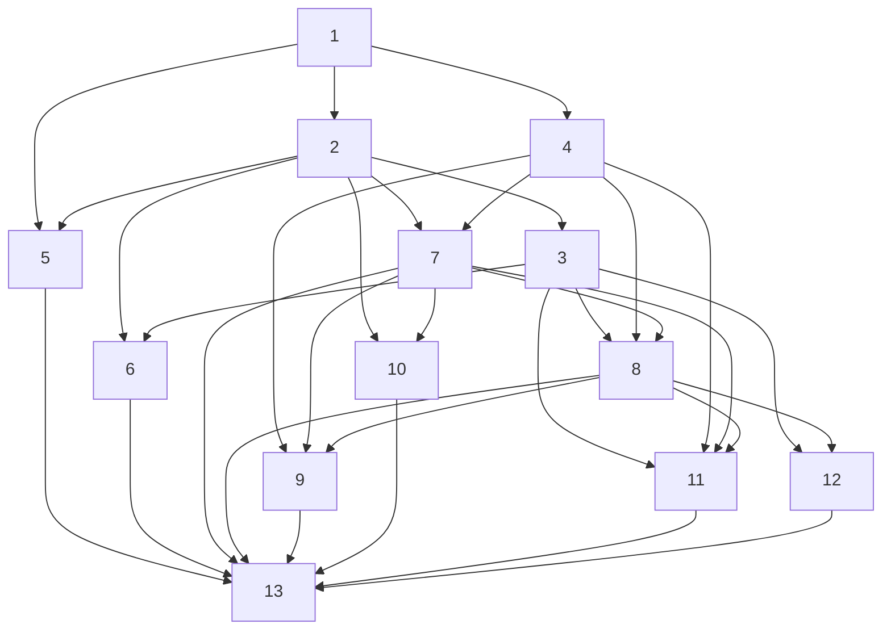

# Implementation Plan

## Overview

AI Mock Interview Coach 프론트엔드 구현 — Upload Screen, Waiting Room, Interview Screen (실시간 음성 스트리밍, Practice Mode, Guide 패널), 인터뷰 종료 및 Feedback 전환까지. React + TypeScript + Vite 기반 SPA로, WebSocket을 통해 Nova Sonic과 통신한다. 외부 인터페이스(Agent 1, Agent 3, WebSocket 서버)는 mock/stub으로만 처리.

## Task Dependency Graph



```json
{
  "waves": [
    [1],
    [2, 4],
    [3, 5, 7],
    [6, 8, 10],
    [9, 11, 12],
    [13]
  ]
}
```

## Tasks

- [x] 1. 프로젝트 초기 세팅: Vite + React + TypeScript 프로젝트 초기화 (frontend/ 디렉토리), 의존성 설치 (react, react-dom, typescript, vite, vitest, @testing-library/react, fast-check, mock-socket), tsconfig.json 설정, Vite 설정, 디렉토리 구조 생성 (components, hooks, services, reducers, types, utils, worklets), 전역 타입 정의 파일 생성 (SessionState, TranscriptEntry, CompetencyGuide, SessionError, SessionAction 등)
  - **Requirements**: N/A (인프라)
  - **Dependencies**: None

- [x] 2. SessionManager (Reducer + Context): reducers/sessionReducer.ts 구현 (SUBMIT_UPLOAD, AGENT1_SUCCESS/FAILED, WS_CONNECTED, SESSION_START_ACKED, WS_DISCONNECTED, WS_RECONNECT_SUCCESS/FAILED, WS_SESSION_INVALID, INTERVIEW_READY, AI_SPEAKING, USER_TURN, BARGE_IN, APPEND_TRANSCRIPT, TOGGLE_PRACTICE_MODE, TEXT_INPUT_START/CLEAR, END_INTERVIEW, AGENT3_LOADING/SUCCESS/FAILED, TIMEOUT, TICK, RESET), SessionContext + SessionProvider 구현, maybeStartSession() 조율 로직 (AGENT1_SUCCESS와 WS_CONNECTED 양쪽에서 호출), 단위 테스트 + PBT (Property 8, 13)
  - **Requirements**: All (상태 관리 중심)
  - **Dependencies**: 1

- [x] 3. WebSocketClient 서비스: services/webSocketClient.ts 구현 (connect, disconnect, getState, sendSessionStart → Promise with ack 대기, sendAudioChunk, sendTextInput), 재연결 로직 (exponential backoff 1s/2s, 최대 2회), session_start_ack 수신 처리, session_invalid 수신 처리, mock-socket 기반 WS 서버 stub, 단위 테스트 + PBT (Property 7)
  - **Requirements**: 2.2, 2.4, 3.1, 3.14
  - **Dependencies**: 1, 2

- [x] 4. AudioManager 서비스: services/audioManager.ts 구현 (initialize, startCapture, pauseCapture, resumeCapture, enqueueAudio, stopPlayback, waitForPlaybackEnd, isPlaying, destroy), worklets/captureProcessor.ts (AudioWorkletProcessor, 16kHz 16-bit mono 512 frame), 에코 캔슬레이션 설정, 출력 재생 (24kHz PCM AudioBufferSourceNode 체인), 단위 테스트 + PBT (Property 5, 6)
  - **Requirements**: 3.1, 3.2, 3.4, 3.7, 3.9, 3.10
  - **Dependencies**: 1

- [x] 5. Upload Screen 컴포넌트: components/UploadScreen.tsx (FileUploader 드래그앤드롭 + 파일 선택, JDTextarea, SubmitButton), utils/uploadValidator.ts (MIME type + 10MB 크기 체크), PDF/크기 에러 메시지 표시, 제출 시 PDF base64 변환 + JD text 전달, 단위 테스트 + PBT (Property 1, 2)
  - **Requirements**: 1.1, 1.2, 1.3, 1.4, 1.5
  - **Dependencies**: 1, 2

- [x] 6. Waiting Room 컴포넌트: components/WaitingRoom.tsx (로딩 아이콘 + 대기 문구, 30초 타임아웃, 에러 표시 + 재시도/돌아가기 버튼), Agent 1 HTTP POST mock/stub, 병렬 요청 + maybeStartSession 조율 (agent1Ready, wsConnectionState 추적), 부분 재시도 (실패 항목만 재요청, 성공 캐시 유지), WS 재시도 시 캐시된 novaSonicContext로 session_start 재전송, 단위 테스트 + PBT (Property 3, 4)
  - **Requirements**: 2.1, 2.2, 2.3, 2.4, 2.5, 2.6
  - **Dependencies**: 2, 3

- [x] 7. Interview Screen 레이아웃 및 기본 UI: components/InterviewScreen.tsx (다크 테마 Zoom 스타일, ParticipantTiles AITile/UserTile 웨이브폼, ControlBar EndButton/PracticeModeToggle, Timer TICK 기반, TextInput fallback), Turn 상태 시각 표시 (ai_speaking/user_turn), beforeunload 등록/해제, 종료 버튼 항상 활성, 단위 테스트 + PBT (Property 15, 16)
  - **Requirements**: 3.5, 3.12, 3.13, 3.15, 4.2, 4.8, 8.3
  - **Dependencies**: 2, 4

- [ ] 8. Interview Screen 음성 스트리밍 통합: 인터뷰 진입 시 AudioManager.startCapture + WebSocket audio_chunk 전송 루프, audio_output 수신 → enqueueAudio + 웨이브폼 활성, interrupted 수신 → stopPlayback + turnState 전환, text_output 수신 → transcript 누적 (FINAL만) + Practice bubble 업데이트, 마이크 권한 거부 → 텍스트 전용 모드 전환 (오디오 재생 유지), 통합 테스트 (mock WS 서버)
  - **Requirements**: 3.1, 3.2, 3.3, 3.4, 3.9, 3.10
  - **Dependencies**: 3, 4, 7

- [ ] 9. Interview Screen 텍스트 입력 및 동시 제어: TextInput 컴포넌트 (첫 글자 입력 → TEXT_INPUT_START → pauseCapture, 텍스트 제출 → text_input 전송 + TEXT_INPUT_CLEAR → resumeCapture, 입력창 비워짐 → TEXT_INPUT_CLEAR → resumeCapture), 제출된 답변 말풍선 미표시 (Practice Mode 무관), 단위 테스트 (composing 상태 전이, pauseCapture/resumeCapture 호출)
  - **Requirements**: 3.6, 3.7, 3.8
  - **Dependencies**: 4, 7, 8

- [ ] 10. Practice Mode + Guide 패널: PracticeModeToggle (초기값 ON), PracticeBubbles (ON → interviewer 텍스트 말풍선, OFF → 숨김, ON→OFF → 즉시 제거), components/GuidePanel.tsx (competency_guides 상시 표시), utils/keywordMatcher.ts (case-insensitive 한글/영문 매칭, word boundary), Practice Mode ON + 새 텍스트 → 하이라이트, OFF → 하이라이트 비활성, 단위 테스트 + PBT (Property 8, 9, 10, 11, 12)
  - **Requirements**: 5.1, 5.2, 5.3, 5.4, 5.5, 5.6, 6.1, 6.2, 6.3
  - **Dependencies**: 2, 7

- [ ] 11. 인터뷰 종료 흐름: EndConfirmModal (확인/취소), 수동 종료 (확인 → stopPlayback + session_end + disconnect + Feedback 전환), 자동 종료 (end_interview tool_use → waitForPlaybackEnd + session_end + disconnect + Feedback 전환), transcript Agent 3 HTTP POST (mock/stub), Agent 3 실패 → 에러 + 재시도, components/FeedbackScreen.tsx (로딩/에러/결과 분기), 통합 테스트 + PBT (Property 14)
  - **Requirements**: 4.1, 4.2, 4.3, 4.4, 4.5, 4.6, 4.7, 4.8
  - **Dependencies**: 3, 4, 7, 8

- [ ] 12. WebSocket 재연결 (인터뷰 중): 끊김 감지 → 자동 재연결 (최대 2회, backoff), 재연결 중 UI 표시, 성공 + 세션 유효 → state 유지 계속 진행, 세션 무효 → 에러 + 업로드 복귀, 재연결 실패 → 에러 + 업로드 복귀, 통합 테스트
  - **Requirements**: 3.14
  - **Dependencies**: 3, 8

- [ ] 13. 다크 테마 스타일링 + 최종 통합: 전역 다크 테마 CSS (Zoom 스타일), 웨이브폼 애니메이션 (CSS/Canvas), 반응형 레이아웃, 전체 E2E 통합 테스트 (Upload → Waiting → Interview → Feedback), vite build 성공 확인
  - **Requirements**: 8.2, 8.3
  - **Dependencies**: 5, 6, 7, 8, 9, 10, 11, 12

## Notes

- 외부 인터페이스(Agent 1, Agent 3, WebSocket 서버)는 mock/stub으로만 처리 — 실제 백엔드 구현은 별도 spec 소관
- Practice Mode 초기값은 ON (Req 2.3)
- Property-based tests는 fast-check 라이브러리 사용, 최소 100회 반복
- Transcript의 role은 'interviewer' | 'user', timestamp는 ISO 8601 프론트 로컬 시간
- wsReady = WS handshake + session_start 전송 + 서버 ack 수신 완료 (단순 handshake 아님)
- session_start는 agent1Ready 이후에만 전송 가능 (novaSonicContext 필요)
