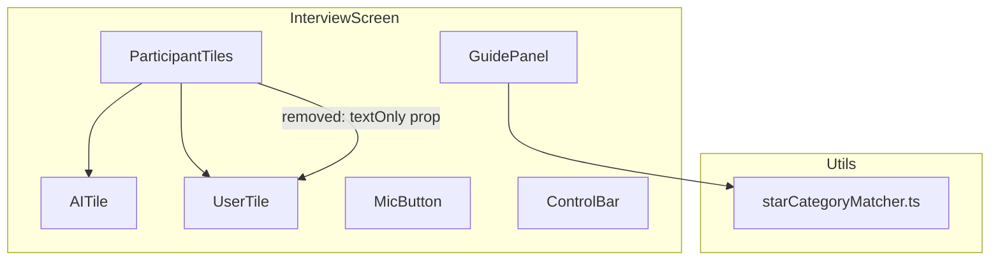

# Design Document: Guide Panel UX Improvements

## Overview

This feature applies five related UX improvements to the interview screen and Guide Panel components. The changes span three categories: **content localization** (Korean → English), **visual consistency** (accent color unification, section labels), and **interaction correctness** (mic-denied flow fix, layout spacing).

All changes are frontend-only. No backend Lambda, S3 configuration, or Bedrock integration is affected. The modifications touch:

- `starCategoryMatcher.ts` — reasoning text translations
- `GuidePanel.tsx` — card labels, section descriptors, color tokens
- `InterviewScreen.tsx` — `UserTile`/`ParticipantTiles` prop removal, error message update, CSS layout

### Design Decisions

| Decision | Rationale |
|----------|-----------|
| Translate reasoning in-place (no i18n library) | Single-language app for V1; no runtime overhead. |
| Remove `textOnly` prop entirely rather than hide it | Text-mode fallback was never a real feature — mic is required. Removing dead code reduces maintenance. |
| Keep `inputMode` field in reducer | Still needed to gate mic-denied error banner visibility. |
| Use CSS flexbox `flex: 1` on tiles instead of fixed heights | Responsive across viewports; meets Req 5.5 (no fixed pixel heights). |
| All accent references use `var(--color-accent)` | Single source of truth; future theme changes propagate automatically. |

---

## Architecture



**Data flow (unchanged):**
1. `SessionContext` provides `analystOutput` and `state.inputMode`
2. `InterviewScreen` passes `analystOutput` to `GuidePanel`
3. `GuidePanel` calls `classifyStarCategory()` and `deriveKeywordChips()` from `starCategoryMatcher.ts`
4. `InterviewScreen` reads `state.inputMode` and `state.error` to conditionally render the mic-denied banner

No new components are introduced. No new dependencies are added.

---

## Components and Interfaces

### 1. `starCategoryMatcher.ts` — Content Changes

**Current state:** `STAR_CATEGORIES[].reasoning` and `DEFAULT_CLASSIFICATION.reasoning` contain Korean text.

**Target state:** All reasoning strings translated to English equivalents that preserve the same coaching intent.

| Category | Current (Korean) | New (English) |
|----------|-----------------|---------------|
| Above & Beyond | 왜 그게 필요했는지… | Why you set a higher bar than expected + how you solved it |
| Team Experience | 팀 내에서 실제로 어떻게… | What you actually did within the team and how it affected outcomes |
| Initiative | 시키지 않았는데 스스로… | Show that you set your own goal without being told to |
| Leadership | 어떻게 팀을 움직였고… | How you moved the team and what changed as a result |
| Failure / Mistake | 무엇을 했는지보다… | Focus on acknowledging the failure and what you learned — Learning matters more than Result here |
| Pressure / Time | 우선순위 판단 과정… | Your prioritization process — what you chose to do first and why |
| Problem Solving | 접근 방식, 시도와 조정… | Your approach, iterations, and adjustments |
| Communication | 상대가 누구였는지를… | Briefly establish who the audience was, then explain how you adapted your communication |
| DEFAULT | 일반적인 행동 질문입니다… | General behavioral question. Keep Situation and Task brief; focus on your Actions and Results. |

**Interface** — unchanged. `StarCategory`, `StarClassification`, `classifyStarCategory()`, and `deriveKeywordChips()` retain the same TypeScript signatures.

### 2. `GuidePanel.tsx` — Section Labels & Color

**New card structure (per STAR card):**

```
┌─────────────────────────────────────┐
│ EXPECTED QUESTION 1  (accent green) │  ← renamed from "예상 질문 N"
│                                     │
│ Question focus:        (11px, gray) │  ← new label
│ [topic text]                        │
│                                     │
│ Skills to highlight:   (11px, gray) │  ← new label
│ [chip] [chip] [chip]                │
│                                     │
│ Question type:         (11px, gray) │  ← new label
│ [category label]                    │
│                                     │
│ Emphasize in your answer:           │  ← new label
│ [Action] [Result]      (green bg)   │  ← badge color changed blue→green
│                                     │
│ [reasoning text — now in English]   │
│                                     │
│ Relevant experience:   (11px, gray) │  ← conditional label
│ [title] · [organization]            │
└─────────────────────────────────────┘
```

**CSS token changes:**

| Selector | Before | After |
|----------|--------|-------|
| `.star-card__label` color | `var(--color-guide-highlight, #4A9EFF)` | `var(--color-accent, #9AE05C)` |
| `.star-card__element-badge` color | `var(--color-guide-highlight, #4A9EFF)` | `var(--color-accent, #9AE05C)` |
| `.star-card__element-badge` background | `rgba(74, 158, 255, 0.12)` | `rgba(154, 224, 92, 0.12)` |

All `#4A9EFF` and `--color-guide-highlight` references are removed from GuidePanel styles.

### 3. `UserTile` — Prop Removal

**Before:**
```typescript
function UserTile({ isActive, textOnly, text }: { isActive: boolean; textOnly: boolean; text: string | null })
```

**After:**
```typescript
function UserTile({ isActive, text }: { isActive: boolean; text: string | null })
```

Removed behaviors:
- Keyboard icon (⌨️) rendering
- "(Text Mode)" label suffix
- `textOnly` conditional logic in waveform/icon display

**Result:** `UserTile` shows either the waveform (when active) or the 👤 icon (when idle). No text-mode state.

### 4. `ParticipantTiles` — Prop Removal

**Before:**
```typescript
function ParticipantTiles({ turnState, textOnly, latestInterviewerText, latestUserText }: ...)
```

**After:**
```typescript
function ParticipantTiles({ turnState, latestInterviewerText, latestUserText }: ...)
```

The `textOnly` prop is no longer forwarded to `UserTile`.

### 5. `InterviewScreen` — Error Message & Layout

**Error banner:**
- Condition changes from `state.inputMode === 'text_only' && state.error?.code === 'MIC_DENIED'` to `state.error?.code === 'MIC_DENIED'`
- Message changes to: `"Microphone access is required. Please allow microphone permission in your browser settings and refresh the page."`
- `role="alert"` retained for accessibility

**Layout CSS changes (left panel):**

| Property | Before | After |
|----------|--------|-------|
| `.participant-tiles` | `flex: 1` only | `flex: 1; min-height: 0;` (enables flex children to shrink) |
| `.participant-tile` | No explicit flex | `flex: 1; min-height: 120px;` (proportional fill with minimum) |
| `.mic-button-wrapper` padding-top | `24px 0` (padding shorthand) | `padding: 12px 0 24px` (reduced top gap) |
| `.interview-screen__left` | `gap: 12px` | `gap: 8px` (tighter spacing) |

These changes ensure visually even vertical distribution (tiles expand proportionally; mic button sits closer below).

---

## Data Models

No new data models are introduced. Existing interfaces are unchanged:

- `StarCategory` — `reasoning` field type remains `string`
- `StarClassification` — same shape
- `SessionState.inputMode` — type `'voice' | 'text_only'` retained (still used for mic-gating logic)
- `SessionState.error` — same `SessionError` interface

The `MIC_DENIED` reducer case is updated to change only the error message string. The `inputMode: 'text_only'` assignment remains since it correctly disables mic-related UI behaviors.

---

## Correctness Properties

*A property is a characteristic or behavior that should hold true across all valid executions of a system — essentially, a formal statement about what the system should do. Properties serve as the bridge between human-readable specifications and machine-verifiable correctness guarantees.*

### Prework: Acceptance Criteria Testing Analysis

**1.1** THE Star_Category_Matcher SHALL define all `reasoning` string values in English only.
- Thoughts: This is a data constraint on every entry in the STAR_CATEGORIES array. We can test that no entry contains Korean characters (Unicode range test). This applies universally to all entries.
- Classification: PROPERTY
- Test Strategy: For all entries in STAR_CATEGORIES, assert reasoning contains no characters in the Korean Unicode range.

**1.2** THE Star_Category_Matcher SHALL define `DEFAULT_CLASSIFICATION.reasoning` in English only.
- Thoughts: Same as 1.1 but for the default. Can be combined with 1.1.
- Classification: PROPERTY (combine with 1.1)

**1.3** THE Guide_Panel SHALL render STAR card labels as "Expected Question N".
- Thoughts: This is a specific rendering check for 3 cards. Example-based test is sufficient.
- Classification: EXAMPLE

**1.4** WHEN the Guide_Panel renders any STAR card, zero Korean characters SHALL appear.
- Thoughts: This tests the rendered output for all possible analystOutput shapes. We can generate random analystOutput data and verify no Korean appears in rendered text.
- Classification: PROPERTY
- Test Strategy: Generate random InterviewPlanItem arrays, render GuidePanel, assert no Korean Unicode in text content.

**1.5** FOR ALL entries in STAR_CATEGORIES, translating reasoning to English then classifying any topic SHALL produce the same StarClassification structure.
- Thoughts: This is a structural invariant — classification depends only on triggerKeywords matching, not on reasoning text. For any topic/targetSkill input, the label and starElements must be identical regardless of reasoning language. This is a metamorphic property.
- Classification: PROPERTY
- Test Strategy: For any random (topic, targetSkill) pair, classifyStarCategory returns a result where label and starElements are deterministic based on keyword matching — reasoning text content does not affect classification output.

**2.1–2.7** Section labels ("Question focus:", "Skills to highlight:", etc.) rendering.
- Thoughts: These test that specific label strings appear in rendered cards. Example-based tests with concrete analystOutput.
- Classification: EXAMPLE

**3.1–3.4** Green accent color unification.
- Thoughts: These test CSS values — no blue color references remain. Can be tested by inspecting style blocks.
- Classification: EXAMPLE
- Test Strategy: Snapshot or string-search the rendered style block for absence of `#4A9EFF`.

**4.1** Mic-denied error message content.
- Thoughts: Specific message string verification.
- Classification: EXAMPLE

**4.2–4.5** UserTile/ParticipantTiles prop removal.
- Thoughts: TypeScript compilation verifies prop removal. Runtime: example tests verify no keyboard icon or "(Text Mode)" text renders.
- Classification: EXAMPLE

**5.1–5.5** Vertical layout spacing.
- Thoughts: CSS layout — not amenable to PBT. Visual regression or snapshot testing.
- Classification: SMOKE

### Property Reflection

Reviewing identified properties:
- **1.1 + 1.2**: "No Korean in reasoning" — these are the same check applied to STAR_CATEGORIES and DEFAULT_CLASSIFICATION. **Combine into one property.**
- **1.4**: "No Korean in rendered GuidePanel" — subsumes 1.1/1.2 at the rendering layer, but 1.1/1.2 test the data source directly (unit level) while 1.4 tests integration. **Keep both — they test different layers.**
- **1.5**: "Classification structure invariant" — unique, tests that keyword-based classification is independent of reasoning content. **Keep.**

Final properties: 3 (one data-level Korean check, one render-level Korean check, one classification invariant).

---

### Property 1: All reasoning strings contain no Korean characters

*For any* entry in `STAR_CATEGORIES` and for `DEFAULT_CLASSIFICATION`, the `reasoning` field SHALL contain zero characters in the Korean Unicode ranges (Hangul Syllables U+AC00–U+D7AF, Hangul Jamo U+1100–U+11FF, Hangul Compatibility Jamo U+3130–U+318F).

**Validates: Requirements 1.1, 1.2**

### Property 2: Rendered Guide Panel contains no Korean text

*For any* valid `analystOutput` containing an `interview_plan` array of 1–3 items with arbitrary `topic` and `target_skill` strings, rendering `GuidePanel` SHALL produce text content containing zero Korean Unicode characters.

**Validates: Requirements 1.4**

### Property 3: Classification is independent of reasoning text

*For any* pair of strings `(topic, targetSkill)`, the output of `classifyStarCategory(topic, targetSkill)` SHALL produce a `StarClassification` where `label` and `starElements` are determined solely by keyword matching against `STAR_CATEGORIES[].triggerKeywords` — the content of `reasoning` fields does not influence the returned `label` or `starElements`.

**Validates: Requirements 1.5**

---

## Error Handling

| Scenario | Current Behavior | New Behavior |
|----------|-----------------|--------------|
| `MIC_DENIED` action dispatched | Sets `inputMode: 'text_only'`, shows error with "Switching to text-only mode" | Sets `inputMode: 'text_only'`, shows error with "Microphone access is required. Please allow microphone permission in your browser settings and refresh the page." |
| `analystOutput` is null | GuidePanel renders empty list | Unchanged — no labels rendered when no cards exist |
| `analystOutput.interview_plan` has 0 items | GuidePanel renders empty list | Unchanged |
| `relatedExperience` is null on a card | Experience section not rendered | "Relevant experience:" label also not rendered (Req 2.6) |

No new error states are introduced. The error banner still uses `role="alert"` for screen reader announcements.

---

## Testing Strategy

### Property-Based Tests (via `fast-check`)

The project already uses `fast-check` (visible in existing test files). PBT is appropriate for the `starCategoryMatcher` module because:
- It contains pure functions with clear input/output
- The "no Korean characters" invariant should hold for ALL entries
- Classification behavior is universal across all string inputs

**Configuration:**
- Minimum 100 iterations per property test
- Tag format: `Feature: guide-panel-ux-improvements, Property N: [description]`

| Property | Test Target | Generator Strategy |
|----------|-------------|-------------------|
| 1 | `STAR_CATEGORIES`, `DEFAULT_CLASSIFICATION` | Enumerate all entries (exhaustive — small fixed array) |
| 2 | `GuidePanel` rendered output | `fc.array(fc.record({topic: fc.string(), target_skill: fc.string(), ...}), {minLength:1, maxLength:3})` |
| 3 | `classifyStarCategory` | `fc.tuple(fc.string(), fc.string())` — random topic/targetSkill pairs |

### Unit Tests (example-based)

| Area | Test Cases |
|------|------------|
| GuidePanel labels | Renders "Expected Question 1/2/3", section labels present, conditional "Relevant experience:" label |
| Color references | Style block contains no `#4A9EFF` or `--color-guide-highlight` |
| UserTile | No `(Text Mode)` text, no ⌨️ icon, waveform shown when active, 👤 icon when idle |
| ParticipantTiles | Renders without `textOnly` prop, TypeScript compilation passes |
| Mic-denied banner | Correct message text, `role="alert"` attribute present |
| Reducer `MIC_DENIED` | Error message matches new string, `inputMode` still set to `'text_only'` |

### Visual / Snapshot Tests

| Area | Approach |
|------|----------|
| Vertical layout (Req 5) | Manual visual QA + optional CSS snapshot to verify no fixed pixel heights on tiles |
| Color consistency (Req 3) | Rendered style string assertion (no blue tokens) |

### What is NOT Tested with PBT

- CSS layout spacing (Req 5) — purely visual, no computable property
- Section label rendering (Req 2) — fixed strings, example tests suffice
- Color token values (Req 3) — static CSS, string matching is adequate
