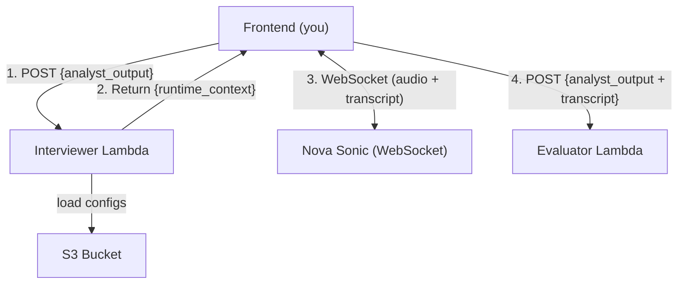

# Design Document: Interviewer Module

## Overview

The Interviewer module is a stateless AWS Lambda (Python 3.12) that builds a runtime context for Amazon Nova Sonic. It receives the Analyst output from the frontend, loads two configuration files from S3, combines everything into a single system instruction string, and returns it. The frontend then passes that string to Nova Sonic via WebSocket to conduct the spoken interview.

This Lambda makes no LLM calls, streams no audio, scores nothing, and is not involved after returning the runtime context.

### Design Goals

- **Single responsibility**: Accept input, load configs, assemble context, return it
- **Stateless**: No database, no session tracking — the frontend holds all state
- **Configurable**: Interview format and behavior defined in S3, changeable without redeploy
- **Pass-through**: Analyst output included in the context unchanged
- **Simple failure modes**: Fail fast with clear error messages

## Architecture



**Steps 1–2** are this module's scope. Steps 3–4 are owned by the frontend.

## Infrastructure

| Resource | Value |
|----------|-------|
| Region | `us-east-1` |
| Runtime | Python 3.12 |
| S3 Bucket | `cic-mock-interview-configs-002859476624` |
| Structure Key | `interview_structure.json` |
| Profile Key | `student_interview_profile.json` |
| Invocation | Lambda Function URL (no API Gateway) |
| CORS | Configured on Function URL, not in code |

## Module Structure

```
interviewer/
  __init__.py           # Empty, makes it a package
  handler.py            # Lambda entry point
  validation.py         # Input validation
  config_loader.py      # S3 fetch for interview configs
  context_builder.py    # Assembles runtime context string
  .env                  # Environment variables (not deployed, reference only)
```

## Components and Interfaces

### handler.py

The Lambda entry point. Detects invocation mode, orchestrates the pipeline, returns the response.

```python
import json
import traceback
from interviewer.validation import validate_input
from interviewer.config_loader import load_interview_structure, load_interview_profile, ConfigLoadError
from interviewer.context_builder import build_runtime_context
import os


def lambda_handler(event: dict, context) -> dict:
    """
    Entry point. Supports two invocation modes:
    - Function URL: event has 'body' key containing a JSON string
    - Direct invocation: event IS the payload

    Returns:
        {"statusCode": int, "body": "<JSON string>"}
    """
```

**Logic flow:**

1. If `event` has a `body` key → parse `event['body']` as JSON. If parse fails → return 400.
2. If `event` has no `body` key → use `event` as the payload directly.
3. Call `validate_input(payload)` → if error, return 200 with error.
4. Call `load_interview_structure(...)` → if `ConfigLoadError`, return 200 with error.
5. Call `load_interview_profile(...)` → if `ConfigLoadError`, return 200 with error.
6. Call `build_runtime_context(analyst_output, structure, profile)` → get context string.
7. Return 200 with `{"success": true, "runtime_context": context_string}`.
8. Wrap everything in try/except → unhandled exceptions return 500.

**Response format (always):**

```python
{
    "statusCode": int,
    "body": json.dumps({"success": bool, ...})
}
```

### validation.py

Single function. Validates that `analyst_output` exists and is non-empty.

```python
def validate_input(payload: dict) -> tuple[dict | None, str | None]:
    """
    Check that the payload contains a non-empty analyst_output.

    Args:
        payload: The parsed request payload dict.

    Returns:
        (analyst_output, None) on success.
        (None, error_message) on failure.

    Validation rules:
        - payload must be a dict
        - payload must contain 'analyst_output' key
        - analyst_output must be a non-empty dict

    Does NOT validate the internal schema of analyst_output.
    """
```

### config_loader.py

Fetches JSON configs from S3. Each function is independent.

```python
import json
import boto3
import os


class ConfigLoadError(Exception):
    """Raised when an S3 config cannot be loaded or parsed."""
    pass


# S3 client created at module level (reused across warm invocations)
_s3_client = boto3.client("s3", region_name=os.environ.get("AWS_REGION", "us-east-1"))


def load_interview_structure(bucket: str, key: str) -> dict:
    """
    Fetch and parse interview_structure.json from S3.

    Args:
        bucket: S3 bucket name (from S3_BUCKET env var)
        key: S3 object key (from INTERVIEW_STRUCTURE_KEY env var)

    Returns:
        Parsed dict of the interview structure.

    Raises:
        ConfigLoadError: If the object is missing, inaccessible, or not valid JSON.
            Error message will include "interview_structure" for identification.
    """


def load_interview_profile(bucket: str, key: str) -> dict:
    """
    Fetch and parse student_interview_profile.json from S3.

    Args:
        bucket: S3 bucket name (from S3_BUCKET env var)
        key: S3 object key (from INTERVIEW_PROFILE_KEY env var)

    Returns:
        Parsed dict of the interview profile.

    Raises:
        ConfigLoadError: If the object is missing, inaccessible, or not valid JSON.
            Error message will include "interview_profile" for identification.
    """
```

**Error handling:**
- Catch `botocore.exceptions.ClientError` (NoSuchKey, AccessDenied, etc.)
- Catch `json.JSONDecodeError` (file exists but isn't valid JSON)
- Wrap both in `ConfigLoadError` with a descriptive message

### context_builder.py

Combines all inputs into a single string that becomes Nova Sonic's system instruction.

```python
import json


def build_runtime_context(
    analyst_output: dict,
    interview_structure: dict,
    interview_profile: dict
) -> str:
    """
    Assemble the runtime context for Nova Sonic.

    Args:
        analyst_output: Full Analyst output (included as-is, JSON-serialized).
        interview_structure: What the interview covers (from S3).
        interview_profile: How the interviewer behaves (from S3).

    Returns:
        A formatted string containing all three sections plus behavioral
        instructions. This string is used directly as Nova Sonic's system
        instruction.

    The output format:
        [CANDIDATE DATA]
        <JSON dump of analyst_output>

        [INTERVIEW STRUCTURE]
        <JSON dump of interview_structure>

        [INTERVIEW PROFILE]
        <JSON dump of interview_profile>

        [BEHAVIORAL INSTRUCTIONS]
        - Ask one question at a time (no compound questions)
        - Keep questions concise and use clear language
        - Follow the tone specified in the interview profile
        - Accept all experience types listed in the interview profile
        - Do not invent details not present in the candidate data
        - Do not give feedback or score answers during the interview
        - Do not ask the candidate to rate themselves
        - Signal transitions between interview points
        - Stop gracefully when the session ends
    """
```

**Key rules:**
- `analyst_output` is JSON-serialized as-is (no filtering, no transformation)
- The behavioral instructions are hardcoded strings, not pulled from config
- Output must be deterministic (same input → same output)

## Data Models

### Input (Request Payload)

```json
{
  "analyst_output": {
    "schema_version": "1.0",
    "candidate_profile": { ... },
    "target_role": { ... },
    "resume_job_alignment": { ... },
    "interview_plan": [ ... ],
    "selected_experiences": [ ... ],
    "analysis_warnings": [ ... ]
  }
}
```

Full schema: `schemas/analyst_output.json`

### S3: Interview Structure

Defines what the interview covers. See: `.kiro/specs/interviewer-agent/schemas/interview_structure.json`

Key fields: `main_question_count`, `max_follow_ups_per_point`, `interview_points[]` (each with focus, topic, objective, listen_for, follow_up_topics).

### S3: Interview Profile

Defines how the interviewer behaves. See: `.kiro/specs/interviewer-agent/schemas/student_interview.json`

Key fields: `tone`, `question_style`, `follow_up_behavior`, `acceptable_experience_types`, `interviewer_rules`, `session_behavior`.

### Output (Success Response)

```json
{
  "statusCode": 200,
  "body": "{\"success\": true, \"runtime_context\": \"<assembled string>\"}"
}
```

### Output (Error Responses)

```json
// Validation or config error (request was well-formed HTTP, error is semantic)
{"statusCode": 200, "body": "{\"success\": false, \"error_message\": \"...\"}"}

// Malformed request body (not valid JSON)
{"statusCode": 400, "body": "{\"success\": false, \"error_message\": \"Request body is not valid JSON\"}"}

// Unhandled exception
{"statusCode": 500, "body": "{\"success\": false, \"error_message\": \"...\"}"}
```

## Request Flow

```
Frontend POST
    │
    ▼
handler.py: detect mode
    ├─ event has 'body'? → json.loads(event['body'])
    │     └─ JSONDecodeError? → return 400
    └─ no 'body'? → payload = event
    │
    ▼
validation.py: validate_input(payload)
    └─ analyst_output missing/empty? → return 200 + error
    │
    ▼
config_loader.py: load_interview_structure(bucket, key)
    └─ ConfigLoadError? → return 200 + error
    │
    ▼
config_loader.py: load_interview_profile(bucket, key)
    └─ ConfigLoadError? → return 200 + error
    │
    ▼
context_builder.py: build_runtime_context(analyst_output, structure, profile)
    │
    ▼
handler.py: return 200 + {"success": true, "runtime_context": "..."}
```

## Error Handling

| Scenario | Status | Error Message Contains |
|----------|--------|----------------------|
| `event['body']` not valid JSON | 400 | `"Request body is not valid JSON"` |
| `analyst_output` missing or empty | 200 | `"analyst_output is required"` |
| S3 structure load fails | 200 | `"interview_structure"` |
| S3 profile load fails | 200 | `"interview_profile"` |
| Unhandled exception | 500 | Exception description |

**Principles:**
- Fail fast: validation errors stop execution before S3 calls
- Semantic errors use 200 (the HTTP layer worked fine)
- No CORS headers in code (Function URL handles it)
- No retries on S3 — the frontend can retry the whole request

## Environment Variables

| Variable | Value | Purpose |
|----------|-------|---------|
| `S3_BUCKET` | `cic-mock-interview-configs-002859476624` | S3 bucket for configs |
| `INTERVIEW_STRUCTURE_KEY` | `interview_structure.json` | S3 key for structure |
| `INTERVIEW_PROFILE_KEY` | `student_interview_profile.json` | S3 key for profile |
| `AWS_REGION` | `us-east-1` | AWS region for S3 client |

## Correctness Properties

1. **Analyst output integrity**: The analyst_output in the runtime context must be identical to what was received — no fields added, removed, or modified.
2. **Complete assembly**: The runtime_context must contain all four sections (analyst_output, structure, profile, behavioral instructions). Missing any section is a bug.
3. **Idempotent**: Same input + same S3 contents = same output, every time.
4. **No side effects**: The Lambda reads from S3 and returns a response. It does not write to S3, call LLMs, invoke other Lambdas, or produce any other effect.
5. **Fail-fast**: If analyst_output is invalid, return error before touching S3.
6. **Mode detection**: Never double-parse (Function URL body parsed as JSON, then treated as a string again) or skip parsing.
7. **Well-formed errors**: Every error path returns `{"success": false, "error_message": "<non-empty>"}`. No bare exceptions or empty bodies.

## Testing Strategy

### Unit Tests

| File | Tests |
|------|-------|
| `validation.py` | Valid payload passes; missing analyst_output fails; empty dict fails; non-dict payload fails |
| `config_loader.py` | Valid S3 JSON parses correctly; missing key raises ConfigLoadError; invalid JSON raises ConfigLoadError; error message contains config name |
| `context_builder.py` | Output contains all four sections; analyst_output appears as JSON; output is a non-empty string; same input produces same output |
| `handler.py` | Function URL mode parses body; direct mode uses event; 400 on bad JSON; 200 + error on validation failure; 200 + error on S3 failure; 200 + success on happy path; 500 on unhandled exception |

### Integration Test

Invoke `lambda_handler` with a realistic analyst_output and mocked S3 (using `unittest.mock.patch` on boto3). Verify the full happy path returns 200 with a runtime_context containing all sections.

### Running Tests

```bash
python3 -m pytest interviewer/tests/ -v
```

Mock boto3 S3 calls — no real AWS credentials needed for tests.

## Deployment

```bash
# Package
cd /path/to/project
zip -r interviewer.zip interviewer/

# Deploy (create or update)
aws lambda create-function \
  --function-name mock-interview-interviewer \
  --runtime python3.12 \
  --handler interviewer.handler.lambda_handler \
  --zip-file fileb://interviewer.zip \
  --role <execution-role-arn> \
  --region us-east-1 \
  --environment "Variables={S3_BUCKET=cic-mock-interview-configs-002859476624,INTERVIEW_STRUCTURE_KEY=interview_structure.json,INTERVIEW_PROFILE_KEY=student_interview_profile.json,AWS_REGION=us-east-1}"

# Enable Function URL
aws lambda create-function-url-config \
  --function-name mock-interview-interviewer \
  --auth-type NONE \
  --cors "AllowOrigins=*,AllowMethods=POST,AllowHeaders=content-type" \
  --region us-east-1
```

**IAM permissions needed:**
- `s3:GetObject` on `arn:aws:s3:::cic-mock-interview-configs-002859476624/*`
- `lambda:InvokeFunctionUrl` and `lambda:InvokeFunction` for the frontend to call it

**No bundled dependencies** — boto3 ships with the Lambda runtime. No pip install needed.
