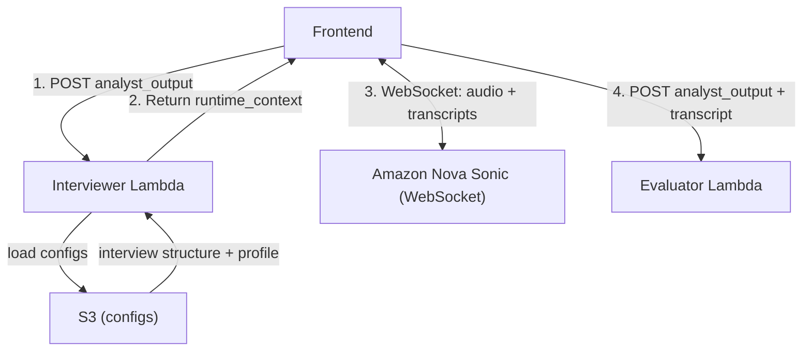

# Design Document: Interviewer Module

## Overview

The Interviewer module is a lightweight session-setup Lambda (Python 3.12) that prepares a runtime context for Amazon Nova Sonic. It receives the complete Analyst output, loads interview configuration from S3, combines everything into a single instruction, and returns it to the frontend. The frontend then connects directly to Nova Sonic via WebSocket to conduct the spoken interview.

This Lambda makes no LLM calls, streams no audio, scores nothing, and has no involvement after returning the runtime context. It is a pure context-builder.

After the interview ends, the frontend sends the original Analyst output plus the Q&A transcript (collected from Nova Sonic session events) directly to the Evaluator Lambda. The Interviewer is not in that path.

### Design Goals

- **Simplicity**: Single request-response Lambda — no WebSocket, no audio, no long-running process
- **Context assembly**: Combines candidate-specific data (Analyst) with configurable interview behavior (S3 configs) into one Nova Sonic system instruction
- **Stateless**: No database, no session tracking — the frontend owns all state
- **Schema pass-through**: The Analyst output is included in the runtime context unchanged
- **Configurable**: Interview structure and profile loaded from S3, swappable without code changes

## Architecture



### End-to-End Flow

1. **Frontend → Interviewer Lambda**: Sends the complete Analyst output
2. **Interviewer Lambda**: Loads interview structure + interview profile from S3, combines them with the Analyst output into a runtime context, returns it
3. **Frontend → Nova Sonic**: Opens a WebSocket connection, provides the runtime context as the system instruction, streams bidirectional audio for the interview
4. **Frontend → Evaluator Lambda**: After the interview ends, sends the Analyst output + the Q&A transcript

### What the Interviewer Lambda Does

1. Parse the request (Function URL or direct invocation)
2. Validate that analyst_output is present and non-empty
3. Load interview structure JSON from S3
4. Load interview profile JSON from S3
5. Assemble the runtime context (analyst_output + interview_structure + interview_profile + behavioral instructions)
6. Return the runtime context to the frontend

### What the Interviewer Lambda Does NOT Do

- Conduct the interview (frontend + Nova Sonic handle this)
- Stream or process audio
- Track interview state or manage turns
- Score or evaluate answers
- Call any LLM or Bedrock text model
- Communicate with the Evaluator

## Module Structure

```
interviewer/
  __init__.py
  handler.py              # Lambda entry point (Function URL + direct invocation)
  validation.py           # Input validation (analyst_output presence)
  config_loader.py        # S3 fetch + basic validation of configs
  context_builder.py      # Assembles runtime context from analyst_output + configs
```

## Components and Interfaces

### handler.py — Lambda Entry Point

```python
def lambda_handler(event: dict, context) -> dict:
    """
    Parse Function URL or direct event, invoke pipeline, return response.

    Supports two modes:
    - Function URL: parse event['body'] as JSON
    - Direct invocation: event IS the payload

    Returns:
        {
            "statusCode": int,       # 200, 400, or 500
            "body": str              # JSON-encoded response body
        }
    """
```

**Success response body:**
```python
{
    "success": True,
    "runtime_context": str   # The assembled system instruction for Nova Sonic
}
```

**Error response body:**
```python
{
    "success": False,
    "error_message": str     # Human-readable description of what went wrong
}
```

### validation.py — Input Validation

```python
def validate_input(payload: dict) -> tuple[dict | None, str | None]:
    """
    Validate the request payload.

    Checks:
    - analyst_output is present and non-empty

    Returns:
        (validated_payload, None) on success
        (None, error_message) on failure
    """
```

### config_loader.py — S3 Configuration Loading

```python
import boto3

class ConfigLoadError(Exception):
    """Raised when an S3 config cannot be loaded or parsed."""
    pass

def load_interview_structure(bucket: str, key: str) -> dict:
    """
    Fetch interview structure JSON from S3.

    Raises ConfigLoadError if the object is missing or not valid JSON.
    """

def load_interview_profile(bucket: str, key: str) -> dict:
    """
    Fetch interview profile JSON from S3.

    Raises ConfigLoadError if the object is missing or not valid JSON.
    """
```

**Environment variables used:**

| Variable | Purpose |
|---|---|
| `S3_BUCKET` | S3 bucket containing interview configs |
| `INTERVIEW_STRUCTURE_KEY` | S3 object key for the interview structure JSON |
| `INTERVIEW_PROFILE_KEY` | S3 object key for the interview profile JSON |

### context_builder.py — Runtime Context Assembly

```python
def build_runtime_context(
    analyst_output: dict,
    interview_structure: dict,
    interview_profile: dict
) -> str:
    """
    Assemble the runtime context that becomes Nova Sonic's system instruction.

    Combines:
    - analyst_output: Full candidate data from the Analyst (included as-is)
    - interview_structure: What the interview covers (points, topics, follow-up guidance)
    - interview_profile: How the interviewer behaves (tone, style, rules)
    - Behavioral instructions for Nova Sonic

    Returns a formatted string suitable for use as Nova Sonic's system instruction.
    """
```

**Behavioral instructions included in the context:**

- Ask one question at a time (no compound questions)
- Keep questions concise and use clear language
- Follow the tone specified by the interview profile
- Accept the experience types listed in the interview profile
- Do not invent details not present in the candidate data
- Do not give feedback or score answers during the interview
- Stop gracefully when the session ends

## Request Flow Detail

```
Frontend POST → handler.py
                  │
                  ├─ event has 'body'? → parse JSON from event['body']
                  │   └─ parse fails? → return 400
                  ├─ no 'body'? → use event as payload directly
                  │
                  ▼
              validation.py
                  │
                  ├─ analyst_output missing/empty? → return 200 with error
                  │
                  ▼
              config_loader.py
                  │
                  ├─ load interview_structure from S3
                  │   └─ fails? → return 200 with error (which config failed)
                  ├─ load interview_profile from S3
                  │   └─ fails? → return 200 with error (which config failed)
                  │
                  ▼
              context_builder.py
                  │
                  ├─ combine analyst_output + structure + profile + instructions
                  │
                  ▼
              handler.py → return 200 with runtime_context
```

## External Schema References

This module consumes and produces data conforming to schemas defined elsewhere:

| Schema | Direction | Purpose |
|---|---|---|
| Analyst → Interviewer | Input | Candidate data from the Analyst (the `analyst_output` field in the request) |
| Interview Structure | Input (S3) | Defines what the interview covers (points, focus, follow-up topics, number of questions) |
| Interview Profile | Input (S3) | Defines how the interviewer behaves (tone, style, expectations, rules) |
| Interviewer → Evaluator | Not used here | The frontend assembles and sends this directly to the Evaluator |

The module validates presence of inputs but does not validate schema conformance — that responsibility belongs to the producing agent (Analyst validates its own output, configs are validated at upload time).

## Error Handling

| Category | Source | HTTP Status | Behavior |
|---|---|---|---|
| Malformed request | Handler | 400 | `event['body']` missing/null/not-JSON |
| Missing analyst_output | Validator | 200 | Returns `{success: false, error_message: ...}` |
| S3 config load failure | ConfigLoader | 200 | Returns error identifying which config failed |
| Unhandled exception | Handler | 500 | Catch-all with error message |

**Key principles:**

- Validation errors return 200 with `success: false` because the HTTP request itself is well-formed — the error is semantic
- The handler never sets CORS headers (handled by Function URL config)
- No retries on S3 failures — the frontend can retry the request

## Configuration

**Environment variables:**

| Variable | Purpose |
|---|---|
| `S3_BUCKET` | S3 bucket containing interview configs |
| `INTERVIEW_STRUCTURE_KEY` | S3 key for the interview structure JSON |
| `INTERVIEW_PROFILE_KEY` | S3 key for the interview profile JSON |
| `AWS_REGION` | Set to `us-west-2` |

## What the Frontend Handles (Not This Module)

For clarity, here is what the frontend owns after receiving the runtime context:

- Opening the WebSocket connection to Nova Sonic
- Providing the runtime context as Nova Sonic's system instruction
- Streaming audio bidirectionally (microphone → Nova Sonic, Nova Sonic → speaker)
- Tracking interview state (current point, stage, follow-up count)
- Collecting transcripts from Nova Sonic session events
- Handling early stop (closing the session gracefully)
- Sending the Analyst output + transcript to the Evaluator Lambda when the interview ends

## Future Extensibility

- New interview profiles (standard-v1, challenging-v1) added to S3 without code changes
- New interview structures (system-design, behavioral-extended) added as new S3 configs
- The request could include a `profile_id` or `structure_id` field to select which configs to load, allowing the frontend to offer interview type selection
- Schemas are versioned independently — the module can check `schema_version` on loaded configs if needed
