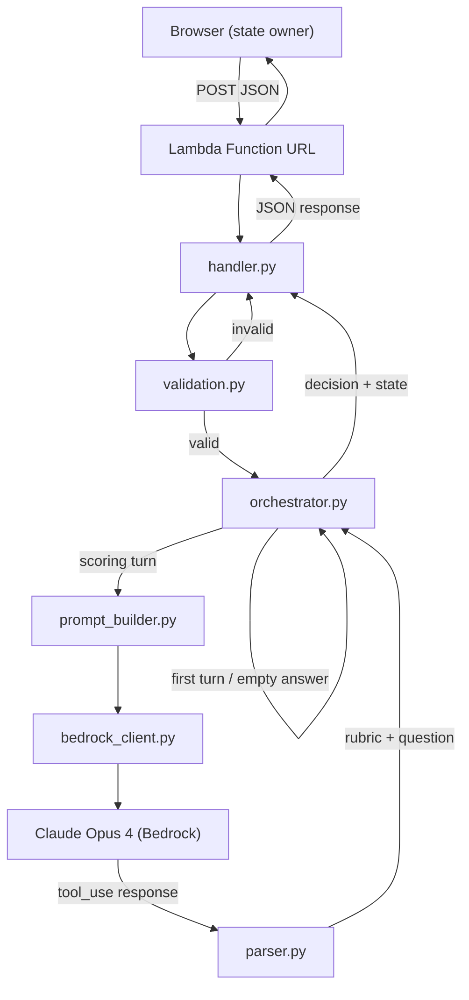

# Design Document: Interviewer Agent

## Overview

The Interviewer Agent is a stateless AWS Lambda (Python 3.12) that powers a turn-based mock interview experience. Each invocation receives the full interview state from the browser, processes one turn (score + decide + generate next question), and returns an updated state for the browser to store.

The key architectural insight is a separation between LLM-generated content (rubric scores and next question) and deterministic control flow (decision logic, state transitions, termination guarantees). Claude Opus 4 acts only as a structured evaluator via tool_use; all flow decisions are computed in Python.

### Design Goals

- **Determinism**: Interview flow is predictable and fully testable without an LLM
- **Statelessness**: No database or storage — the browser owns session state
- **Fail-safe**: Invalid inputs are rejected early; malformed LLM output is caught and surfaced as errors
- **Bounded execution**: Hard limits on follow-ups per point (2), total points (10), and scoring turns (30)

## Architecture



### Request Flow

1. **Handler** parses `event['body']` JSON, delegates to Validator
2. **Validator** checks all required fields, types, and ranges — rejects early with error decision
3. **Orchestrator** determines the turn type:
   - **First turn** (empty history + empty answer): Generate opening question from `interview_points[0]`, bypass Bedrock
   - **Empty answer** (non-empty history + empty answer): Re-ask last question, bypass Bedrock
   - **Scoring turn**: Invoke Claude for rubric scoring, then compute decision
4. **PromptBuilder** assembles system prompt + messages + tool schema for Claude
5. **BedrockClient** calls `converse()` with 30s timeout, single attempt, no retry
6. **Parser** extracts and validates rubric booleans + next_question from tool_use response
7. **Orchestrator** computes decision via pure function, builds updated state
8. **Handler** wraps result in Function URL response format

## Components and Interfaces

### handler.py — Lambda Entry Point

```python
def lambda_handler(event: dict, context) -> dict:
    """
    Parse Function URL event, invoke pipeline, return response.
    
    Returns:
        {
            "statusCode": int,       # 200, 400, or 500
            "body": str              # JSON-encoded response body
        }
    """
```

**Response body schema** (JSON-encoded string):
```python
{
    "judgment": dict | None,        # {concrete_example, situation_action_result, link_to_job, quantifiable_outcome} or null
    "decision": str,                # "next_point" | "follow_up" | "complete" | "error"
    "next_question": str,           # The question for the next turn (empty string on error)
    "interview_complete": bool,     # True iff decision == "complete"
    "interview_state": dict | None, # Updated state or null on error
    "error_message": str | None     # Present only when decision is "error"
}
```

### validation.py — Input Validation

```python
def validate_input(body: dict) -> tuple[dict | None, str | None]:
    """
    Validate the request body.
    
    Args:
        body: Parsed JSON request body
        
    Returns:
        (validated_input, None) on success
        (None, error_message) on validation failure
    
    Validates:
        - interview_points: list of 1-10 strings, all non-empty
        - student_answer: string (or empty/null/missing)
        - interview_state.conversation_history: list
        - interview_state.current_point_index: int in [0, len(interview_points))
        - interview_state.follow_up_count: int in [0, 2]
    """
```

### orchestrator.py — Business Logic

```python
def process_turn(
    interview_points: list[str],
    student_answer: str,
    interview_state: dict
) -> dict:
    """
    Main orchestration: determines turn type, processes, returns result.
    
    Returns:
        {
            "judgment": dict | None,
            "decision": str,
            "next_question": str,
            "interview_complete": bool,
            "interview_state": dict
        }
    """

def compute_decision(
    rubric_judgment: list[bool],
    current_point_index: int,
    follow_up_count: int,
    points_length: int
) -> str:
    """
    Pure deterministic decision function.
    
    Args:
        rubric_judgment: Exactly 4 boolean values
        current_point_index: 0-based index, in [0, points_length)
        follow_up_count: Number of follow-ups so far for current point, in [0, 2]
        points_length: Total number of interview points, in [1, 10]
    
    Returns:
        "next_point" | "follow_up" | "complete"
    
    Raises:
        ValueError: If inputs violate constraints
    """

def update_state(
    interview_state: dict,
    decision: str,
    student_answer: str,
    judgment: dict | None,
    next_question: str
) -> dict:
    """
    Produce the next interview state based on decision.
    
    - next_point: increment current_point_index, reset follow_up_count, append turn
    - follow_up: increment follow_up_count, append turn
    - complete: keep indices, append turn
    - error: return state unchanged (no turn appended)
    """
```

### prompt_builder.py — Prompt Construction

```python
TOOL_SCHEMA = {
    "name": "score_answer",
    "description": "Score the student's answer and provide the next interview question.",
    "inputSchema": {
        "json": {
            "type": "object",
            "properties": {
                "concrete_example": {"type": "boolean"},
                "situation_action_result": {"type": "boolean"},
                "link_to_job": {"type": "boolean"},
                "quantifiable_outcome": {"type": "boolean"},
                "next_question": {"type": "string", "maxLength": 300}
            },
            "required": [
                "concrete_example",
                "situation_action_result",
                "link_to_job",
                "quantifiable_outcome",
                "next_question"
            ]
        }
    }
}

def build_messages(
    conversation_history: list[dict],
    interview_point: str,
    student_answer: str
) -> tuple[list[dict], list[dict]]:
    """
    Build the system prompt and message list for Bedrock Converse API.
    
    Returns:
        (system_prompts, messages) — ready for converse() call
    
    System prompt instructs Claude to:
        - Produce exactly one question (no compound questions)
        - Omit preamble, greetings, and small talk
        - Score the 4 rubric dimensions honestly
    """
```

### bedrock_client.py — Bedrock API Call

```python
import boto3
from botocore.config import Config

BEDROCK_CONFIG = Config(
    region_name="us-west-2",
    read_timeout=30,
    retries={"max_attempts": 0}  # No automatic retries
)

MODEL_ID = "global.anthropic.claude-opus-4-7"

def invoke_claude(
    system_prompts: list[dict],
    messages: list[dict],
    tool_config: dict
) -> dict:
    """
    Call Bedrock Converse API (synchronous, single attempt).
    
    Args:
        system_prompts: System-level prompts
        messages: Conversation messages
        tool_config: Tool configuration with schema
        
    Returns:
        Raw converse() response dict
        
    Raises:
        BedrockInvocationError: On service error, timeout, or throttling
    """
```

### parser.py — Response Parsing and Validation

```python
def parse_response(response: dict) -> dict:
    """
    Extract and validate Claude's tool_use response.
    
    Returns on success:
        {
            "judgment": {
                "concrete_example": bool,
                "situation_action_result": bool,
                "link_to_job": bool,
                "quantifiable_outcome": bool
            },
            "next_question": str
        }
    
    Returns on failure:
        {
            "decision": "error",
            "judgment": None,
            "next_question": None,
            "error_message": str
        }
    
    Validation rules:
        - Response must contain toolUse block at content[0]
        - All 4 rubric fields must be present and strictly boolean (no coercion)
        - next_question must be a non-whitespace string, 1-300 chars
    """
```

## Data Models

### Request Body (from browser)

```python
{
    "interview_points": list[str],   # 1-10 topic strings from Analyst
    "student_answer": str | None,    # Student's latest response (empty on first turn)
    "interview_state": {
        "conversation_history": list[TurnEntry],
        "current_point_index": int,  # 0-based, [0, len(interview_points))
        "follow_up_count": int       # [0, 2]
    }
}
```

### TurnEntry

```python
{
    "student_answer": str,           # May be empty for the opening turn
    "judgment": dict | None,         # Rubric scores or null (first turn, empty answer)
    "question": str                  # The question that was asked
}
```

### Response Body (to browser)

```python
{
    "judgment": {                     # null when no scoring occurred
        "concrete_example": bool,
        "situation_action_result": bool,
        "link_to_job": bool,
        "quantifiable_outcome": bool
    } | None,
    "decision": str,                 # "next_point" | "follow_up" | "complete" | "error"
    "next_question": str,            # Empty string on error
    "interview_complete": bool,      # True iff decision == "complete"
    "interview_state": {             # null on error
        "conversation_history": list[TurnEntry],
        "current_point_index": int,
        "follow_up_count": int
    } | None,
    "error_message": str | None      # Present only on error
}
```

### Decision Truth Table

| rubric_pass (≥3 true) | follow_up_count < 2 | at_last_point | decision |
|---|---|---|---|
| true | — | false | next_point |
| true | — | true | complete |
| false | true | — | follow_up |
| false | false | false | next_point |
| false | false | true | complete |

Where:
- `rubric_pass` = `sum(rubric_judgment) >= 3`
- `at_last_point` = `current_point_index == points_length - 1`

### Termination Bound Proof

- Max points: 10
- Max follow-ups per point: 2 (initial + 2 follow-ups = 3 scoring turns per point max)
- Max scoring turns: 10 × 3 = 30
- Each scoring turn either advances to next_point or increments follow_up_count
- follow_up_count is capped at 2 → forced advance after 3rd turn on a point
- Guaranteed termination: finite points × finite follow-ups per point

## Correctness Properties

*A property is a characteristic or behavior that should hold true across all valid executions of a system — essentially, a formal statement about what the system should do. Properties serve as the bridge between human-readable specifications and machine-verifiable correctness guarantees.*

### Property 1: Decision Function Correctness

*For all* valid inputs (`rubric_judgment` of exactly 4 booleans, `current_point_index` in `[0, points_length)`, `follow_up_count` in `[0, 2]`, `points_length` in `[1, 10]`), the `compute_decision` function SHALL return:
- `"next_point"` when `sum(rubric_judgment) >= 3` and `current_point_index < points_length - 1`
- `"complete"` when `sum(rubric_judgment) >= 3` and `current_point_index == points_length - 1`
- `"follow_up"` when `sum(rubric_judgment) < 3` and `follow_up_count < 2`
- `"next_point"` when `sum(rubric_judgment) < 3` and `follow_up_count >= 2` and `current_point_index < points_length - 1`
- `"complete"` when `sum(rubric_judgment) < 3` and `follow_up_count >= 2` and `current_point_index == points_length - 1`

And the return value SHALL always be one of exactly three strings: `"next_point"`, `"follow_up"`, or `"complete"`.

**Validates: Requirements 3.1, 3.2, 3.3, 3.4, 3.5, 3.6**

### Property 2: Decision Function Input Validation

*For all* inputs where `rubric_judgment` does not contain exactly 4 boolean values, OR `current_point_index` is negative or `>= points_length`, the `compute_decision` function SHALL raise a `ValueError`.

**Validates: Requirements 3.7, 3.8**

### Property 3: State Transition Correctness

*For all* valid interview states and decisions produced by `compute_decision`, the `update_state` function SHALL:
- When decision is `"next_point"`: increment `current_point_index` by 1, reset `follow_up_count` to 0, and append exactly one turn entry to `conversation_history`
- When decision is `"follow_up"`: increment `follow_up_count` by 1, keep `current_point_index` unchanged, and append exactly one turn entry to `conversation_history`
- When decision is `"complete"`: keep both indices unchanged and append exactly one turn entry to `conversation_history`

Each appended turn entry SHALL contain the `student_answer`, `judgment`, and `question` fields from that turn.

**Validates: Requirements 4.1, 4.2, 4.3, 4.5**

### Property 4: Empty Answer State Preservation

*For all* interview states where `conversation_history` is non-empty, if `student_answer` is empty (empty string, whitespace-only, or null), the orchestrator SHALL return the state unchanged (same `current_point_index`, same `follow_up_count`, same `conversation_history` length) and SHALL return the `next_question` from the last entry in `conversation_history`.

**Validates: Requirements 4.6, 7.1, 7.2, 7.3, 8.4**

### Property 5: Parser Round-Trip

*For all* valid rubric judgments (4 booleans) and valid `next_question` strings (1–300 chars, at least 1 non-whitespace), constructing a well-formed Bedrock tool_use response and then parsing it SHALL produce a deeply-equal rubric judgment object and identical `next_question` string.

**Validates: Requirements 2.3, 11.1, 11.4**

### Property 6: Parser Rejection of Invalid Responses

*For all* Bedrock responses that either (a) lack a `toolUse` block, (b) have any rubric field missing or non-boolean, or (c) have `next_question` that is empty/whitespace-only or exceeds 300 characters, the parser SHALL return `decision="error"`, `judgment=None`, and `next_question=None`.

**Validates: Requirements 2.4, 11.3, 1.2**

### Property 7: Validator Rejects Invalid Inputs

*For all* request bodies where any of the following hold: `current_point_index` is out of bounds, `follow_up_count` is outside `[0, 2]`, any required field is missing, or any item in `interview_points` is not a string — the validator SHALL return an error decision with a descriptive message identifying the issue.

**Validates: Requirements 5.1, 5.2, 5.5, 5.7**

### Property 8: Session Termination Bound

*For all* valid interview configurations (1–10 points, starting at index 0 with follow_up_count 0), simulating a worst-case session where every rubric scores below threshold (fewer than 3 true) SHALL terminate within at most `3 × len(interview_points)` scoring turns (maximum 30), and the final decision SHALL be `"complete"`.

**Validates: Requirements 8.1, 8.3**

### Property 9: First Turn Question Length

*For all* interview_points lists (1–10 items, each string), when `conversation_history` is empty and `student_answer` is empty, the returned `next_question` SHALL be at most 300 characters in length.

**Validates: Requirements 6.3**

### Property 10: interview_complete Derivation

*For all* Lambda responses, the `interview_complete` field SHALL equal `True` if and only if `decision == "complete"`.

**Validates: Requirements 9.4**

### Property 11: Response Format Consistency

*For all* inputs to the Lambda handler (valid or invalid), the response SHALL be a dict with `statusCode` (integer in {200, 400, 500}) and `body` (a valid JSON string that, when parsed, contains the keys `judgment`, `decision`, `next_question`, `interview_complete`, and `interview_state`).

**Validates: Requirements 9.6**

## Error Handling

### Error Categories

| Category | Source | HTTP Status | Behavior |
|---|---|---|---|
| Malformed request | Handler | 400 | `event['body']` missing/null/not-JSON |
| Validation failure | Validator | 200 | Invalid field values → `decision: "error"` in body |
| Bedrock failure | BedrockClient | 200 | Service error/timeout/throttle → `decision: "error"` |
| Parse failure | Parser | 200 | Malformed tool_use response → `decision: "error"` |
| Unhandled exception | Handler | 500 | Catch-all for unexpected errors |

### Design Decisions

1. **Validation errors return 200 with error decision** (not 4xx) because the request format is valid JSON — the error is in the semantic content. The frontend checks the `decision` field rather than HTTP status for business logic errors.

2. **No retries on Bedrock failures**: Single-attempt design simplifies reasoning about state. The frontend can retry the entire turn if needed since the Lambda is stateless.

3. **Parser errors are non-fatal to the session**: A malformed Claude response returns `decision: "error"` with state unchanged. The frontend can retry the same turn since no state mutation occurred.

4. **Error responses preserve the input state**: When `decision` is `"error"`, the returned `interview_state` is `None` (not the input state) to signal that the frontend should use its locally stored state for the next request.

### Error Response Shape

All error paths produce the same response structure:
```python
{
    "judgment": None,
    "decision": "error",
    "next_question": "",
    "interview_complete": False,
    "interview_state": None,
    "error_message": "Human-readable description of what went wrong"
}
```

## Testing Strategy

### Property-Based Tests (Hypothesis)

The project will use [Hypothesis](https://hypothesis.readthedocs.io/) for property-based testing in Python. Each property from the Correctness Properties section maps to one Hypothesis test with a minimum of 100 iterations.

**Tag format**: `# Feature: interviewer-agent, Property {N}: {title}`

| Property | Module Under Test | Generator Strategy |
|---|---|---|
| 1: Decision Function Correctness | `orchestrator.compute_decision` | `st.lists(st.booleans(), min_size=4, max_size=4)`, `st.integers(0, 9)`, `st.integers(0, 2)`, `st.integers(1, 10)` with filtering |
| 2: Decision Function Input Validation | `orchestrator.compute_decision` | Invalid rubric lists (wrong length, non-bool items), out-of-range indices |
| 3: State Transition Correctness | `orchestrator.update_state` | Valid states + valid decisions, random conversation histories |
| 4: Empty Answer State Preservation | `orchestrator.process_turn` | Non-empty histories + empty/whitespace answers |
| 5: Parser Round-Trip | `parser.parse_response` | Random 4-boolean rubric + random valid question strings |
| 6: Parser Rejection | `parser.parse_response` | Malformed response dicts (missing keys, wrong types, bad lengths) |
| 7: Validator Rejection | `validation.validate_input` | Bodies with one or more invalid fields |
| 8: Session Termination Bound | `orchestrator.compute_decision` (simulated loop) | Random rubric sequences across full sessions |
| 9: First Turn Question Length | `orchestrator.process_turn` | Random interview_points lists (1-10 string items) |
| 10: interview_complete Derivation | `handler.lambda_handler` | All four decision outcomes |
| 11: Response Format Consistency | `handler.lambda_handler` | Mix of valid and invalid inputs |

### Unit Tests (pytest)

Example-based tests for scenarios that don't benefit from randomization:

- **First turn behavior**: Verify exact response shape (judgment=null, decision=follow_up, etc.)
- **Prompt builder content**: Verify system prompt contains required instructions
- **Tool schema structure**: Verify all 5 fields with correct types
- **Bedrock client config**: Verify model ID, region, timeout, retry settings
- **Handler 400 response**: Missing/null/malformed event body
- **Handler 500 response**: Simulated unhandled exception

### Integration Tests (mocked Bedrock)

- Full happy-path flow: valid input → Bedrock mock returns tool_use → correct response
- Bedrock timeout simulation
- Bedrock throttling simulation
- Multi-turn session simulation (3-4 turns progressing through points)

### Test File Organization

```
interviewer/
  tests/
    __init__.py
    conftest.py              # Shared fixtures, Hypothesis strategies
    test_decision_props.py   # Properties 1, 2, 8
    test_state_props.py      # Properties 3, 4
    test_parser_props.py     # Properties 5, 6
    test_validator_props.py  # Property 7
    test_handler_props.py    # Properties 9, 10, 11
    test_prompt_builder.py   # Unit tests (examples)
    test_bedrock_client.py   # Unit tests (mocked)
    test_integration.py      # Multi-turn integration tests
```

