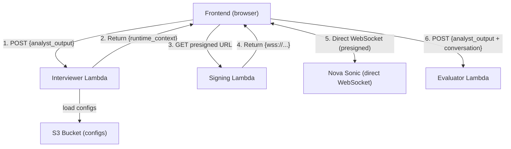

# Design Document: Interviewer Module

## Overview

The Interviewer module has two Lambdas:

1. **Interviewer Lambda** — Builds a runtime context for Nova Sonic from the Analyst output + S3 configs.
2. **Signing Lambda** — Generates a presigned WebSocket URL for the frontend to connect directly to Nova Sonic.

The frontend connects directly to Nova Sonic via the presigned WebSocket URL. There is no proxy server, no AgentCore, no container — just the frontend talking to Nova Sonic with a signed URL.

### Design Goals

- **Simple**: Two Lambdas + direct WebSocket. No containers, no proxy servers.
- **Secure**: AWS credentials never reach the browser. The signing Lambda returns a time-limited presigned URL.
- **Stateless**: No database — frontend holds all state.
- **Configurable**: Interview format and behavior defined in S3, changeable without redeploy.

## Architecture



**Steps 1–2**: Interviewer Lambda (context building)
**Steps 3–4**: Signing Lambda (presign the Nova Sonic WebSocket URL)
**Step 5**: Frontend connects directly to Nova Sonic (no proxy)
**Step 6**: Frontend sends results to Evaluator

## Infrastructure

| Resource | Value |
|----------|-------|
| Region | `us-east-1` |
| Runtime | Python 3.12 |
| Nova Sonic Model | `amazon.nova-2-sonic-v1:0` |
| S3 Bucket | `cic-mock-interview-configs-002859476624` |
| Structure Key | `interview_structure.json` |
| Profile Key | `student_interview_profile.json` |
| Invocation | Lambda Function URLs (both Lambdas) |
| Voice Connection | Frontend → Nova Sonic directly via presigned WSS URL |

## Component 1: Interviewer Lambda

### Module Structure

```
interviewer/
  __init__.py
  handler.py            # Lambda entry point
  validation.py         # Input validation
  config_loader.py      # S3 fetch for interview configs
  context_builder.py    # Assembles runtime context string
  .env                  # Environment variables (reference only)
```

### Request Flow

```
Frontend POST → handler.py
  ├─ event has 'body'? → parse JSON (400 if fails)
  └─ no 'body'? → use event as payload
      │
      ▼
  validation.py → analyst_output missing? → 200 + error
      │
      ▼
  config_loader.py → S3 fails? → 200 + error
      │
      ▼
  context_builder.py → assemble runtime_context
      │
      ▼
  handler.py → 200 + {"success": true, "runtime_context": "..."}
```

### Behavioral Instructions (in runtime_context)

- You MUST speak first when the session starts — greet the candidate briefly and ask the first question immediately
- Keep all questions and responses to 1-2 sentences maximum
- Ask one question at a time (no compound questions)
- Do not explain, summarize, or narrate what you are about to do
- Follow the tone specified in the interview profile
- Accept all experience types listed in the interview profile
- Do not invent details not present in the candidate data
- Do not give feedback or score answers during the interview
- Do not ask the candidate to rate themselves
- Signal transitions between interview points briefly
- Stop gracefully when the session ends

## Component 2: Signing Lambda

### Purpose

Generates a SigV4-presigned WebSocket URL for Nova Sonic's bidirectional streaming endpoint. The frontend uses this URL to connect directly — no proxy needed.

### Module Structure

```
signing/
  __init__.py
  handler.py            # Lambda entry point, generates presigned URL
```

### Interface

```python
def lambda_handler(event: dict, context) -> dict:
    """
    Generate a presigned WebSocket URL for Nova Sonic.

    Returns:
        {
            "statusCode": 200,
            "body": "{\"url\": \"wss://bedrock-runtime.us-east-1.amazonaws.com/...?X-Amz-...\"}"
        }
    """
```

### How Presigning Works

The signing Lambda creates a SigV4-signed URL for:
```
wss://bedrock-runtime.us-east-1.amazonaws.com/model/amazon.nova-2-sonic-v1:0/invoke-with-bidirectional-stream
```

The URL is valid for ~5 minutes. The frontend opens a WebSocket to this URL directly — no additional auth needed.

### Environment Variables

| Variable | Value |
|----------|-------|
| `AWS_REGION` | `us-east-1` |
| `MODEL_ID` | `amazon.nova-2-sonic-v1:0` |

## Data Models

### Interviewer Lambda Input

```json
{ "analyst_output": { "...per schemas/analyst_output.json..." } }
```

### Interviewer Lambda Output (Success)

```json
{"statusCode": 200, "body": "{\"success\": true, \"runtime_context\": \"<string>\"}"}
```

### Signing Lambda Output

```json
{"statusCode": 200, "body": "{\"url\": \"wss://bedrock-runtime.us-east-1.amazonaws.com/model/amazon.nova-2-sonic-v1:0/invoke-with-bidirectional-stream?X-Amz-Algorithm=...\"}"}
```

### Evaluator Input (assembled by frontend)

Per `schemas/evaluator_input.json`.

## Nova Sonic Event Protocol

The frontend speaks the Nova Sonic protocol directly over the presigned WebSocket:

**Setup sequence:**
1. `sessionStart` — inference config + turn detection
2. `promptStart` — audio/text output formats + voice selection
3. `contentStart` (SYSTEM) → `textInput` (runtime_context) → `contentEnd` — system instruction
4. Send silence + `contentEnd` — triggers Nova to speak first

**Each turn:**
5. `contentStart` (USER/AUDIO) → `audioInput` (repeated) → `contentEnd` — user speaks
6. Nova responds: `audioOutput` + `textOutput` events

**End session:**
7. `promptEnd` → `sessionEnd`

## Error Handling

### Interviewer Lambda

| Scenario | Status | Error Message |
|----------|--------|---------------|
| Body not valid JSON | 400 | "Request body is not valid JSON" |
| analyst_output missing | 200 | "analyst_output is required..." |
| S3 fails | 200 | includes config name |
| Unhandled exception | 500 | exception description |

### Signing Lambda

| Scenario | Status | Behavior |
|----------|--------|----------|
| Success | 200 | Returns presigned URL |
| Missing credentials | 500 | Error message |
| Invalid model | 500 | Error message |

## Environment Variables

### Interviewer Lambda

| Variable | Value |
|----------|-------|
| `S3_BUCKET` | `cic-mock-interview-configs-002859476624` |
| `INTERVIEW_STRUCTURE_KEY` | `interview_structure.json` |
| `INTERVIEW_PROFILE_KEY` | `student_interview_profile.json` |
| `AWS_REGION` | `us-east-1` |

### Signing Lambda

| Variable | Value |
|----------|-------|
| `AWS_REGION` | `us-east-1` |
| `MODEL_ID` | `amazon.nova-2-sonic-v1:0` |

## Key Design Decisions

1. **No proxy/relay server**: The frontend connects to Nova Sonic directly. A presigned URL handles auth. This eliminates the container, AgentCore dependency, and the relay latency.
2. **Silence trigger for speak-first**: Nova Sonic is speech-to-speech — it waits for user input. To make it speak first, the frontend sends a brief silence burst + contentEnd to trigger the first response.
3. **Two separate Lambdas**: The Interviewer builds context (needs S3 access), the Signing Lambda creates URLs (needs Bedrock signing). Keeping them separate follows single-responsibility.

## Deployment

### Interviewer Lambda

```bash
zip -r interviewer.zip interviewer/
aws lambda update-function-code \
  --function-name mock-interview-interviewer \
  --zip-file fileb://interviewer.zip \
  --region us-east-1
```

### Signing Lambda

```bash
zip -r signing.zip signing/
aws lambda create-function \
  --function-name mock-interview-signing \
  --runtime python3.12 \
  --handler signing.handler.lambda_handler \
  --zip-file fileb://signing.zip \
  --role arn:aws:iam::002859476624:role/mock-interview-lambda-role \
  --region us-east-1 \
  --environment "Variables={AWS_REGION=us-east-1,MODEL_ID=amazon.nova-2-sonic-v1:0}"
```
