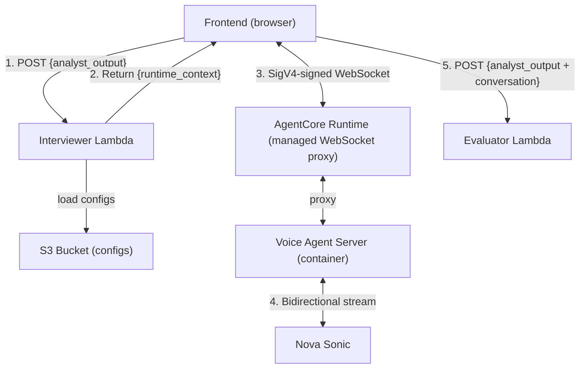

# Design Document: Interviewer Module

## Overview

The Interviewer module has two components:

1. **Interviewer Lambda** — A stateless Python 3.12 Lambda that builds a runtime context for Nova Sonic. It receives the Analyst output, loads S3 configs, assembles a system instruction string, and returns it.

2. **Voice Agent Server** — A Python WebSocket server deployed on Bedrock AgentCore Runtime that proxies bidirectional audio between the browser and Amazon Nova Sonic. The frontend connects to AgentCore's managed WebSocket endpoint (SigV4-authenticated), and the server relays events to/from Nova Sonic.

### Design Goals

- **Single responsibility per component**: Lambda builds context, server relays audio
- **Stateless**: No database — frontend holds all state
- **Managed infrastructure**: AgentCore Runtime handles scaling, auth, and WebSocket lifecycle
- **No credentials on the frontend**: SigV4 signing via AWS SDK, no raw keys in the browser
- **Configurable**: Interview format and behavior defined in S3, changeable without redeploy

## Architecture



**Steps 1–2**: Interviewer Lambda scope (context building)
**Steps 3–4**: Voice Agent Server scope (interview conducting)
**Step 5**: Frontend scope (Evaluator handoff)

## Infrastructure

| Resource | Value |
|----------|-------|
| Region | `us-east-1` |
| Lambda Runtime | Python 3.12 |
| Voice Server | Python (FastAPI + WebSocket), Docker container on AgentCore Runtime |
| Nova Sonic Model | `amazon.nova-2-sonic-v1:0` |
| S3 Bucket | `cic-mock-interview-configs-002859476624` |
| Structure Key | `interview_structure.json` |
| Profile Key | `student_interview_profile.json` |
| Lambda Invocation | Lambda Function URL (no API Gateway) |
| Voice WebSocket | AgentCore Runtime managed endpoint (SigV4 auth) |

## Component 1: Interviewer Lambda

### Module Structure

```
interviewer/
  __init__.py           # Empty, makes it a package
  handler.py            # Lambda entry point
  validation.py         # Input validation
  config_loader.py      # S3 fetch for interview configs
  context_builder.py    # Assembles runtime context string
  .env                  # Environment variables (reference only)
```

### Interfaces

**handler.py** — Lambda entry point:
```python
def lambda_handler(event: dict, context) -> dict:
    # Supports Function URL (event['body']) and direct invocation (event = payload)
    # Returns: {"statusCode": int, "body": "<JSON string>"}
```

**validation.py** — Input validation:
```python
def validate_input(payload: dict) -> tuple[dict | None, str | None]:
    # Returns (analyst_output, None) on success
    # Returns (None, error_message) on failure
```

**config_loader.py** — S3 config loading:
```python
class ConfigLoadError(Exception):
    pass

def load_interview_structure(bucket: str, key: str) -> dict:
def load_interview_profile(bucket: str, key: str) -> dict:
```

**context_builder.py** — Runtime context assembly:
```python
def build_runtime_context(analyst_output: dict, interview_structure: dict, interview_profile: dict) -> str:
    # Returns formatted string with sections:
    # [CANDIDATE DATA], [INTERVIEW STRUCTURE], [INTERVIEW PROFILE], [BEHAVIORAL INSTRUCTIONS]
```

### Request Flow

```
Frontend POST → handler.py
  ├─ event has 'body'? → parse JSON (400 if fails)
  └─ no 'body'? → use event as payload
      │
      ▼
  validation.py → analyst_output missing? → 200 + error
      │
      ▼
  config_loader.py → S3 fails? → 200 + error
      │
      ▼
  context_builder.py → assemble runtime_context
      │
      ▼
  handler.py → 200 + {"success": true, "runtime_context": "..."}
```

## Component 2: Voice Agent Server (AgentCore Runtime)

### Architecture Pattern

Based on the [bedrock-sonic sample](https://github.com/aws-samples/sample-voice-agent-on-aws/tree/main/samples/bidi-streaming/bedrock-sonic). The server is a thin WebSocket relay:

```
Browser WebSocket → AgentCore Runtime → Voice Agent Server → Nova Sonic bidirectional stream
```

### Module Structure

```
voice-agent/
  server.py               # FastAPI/WebSocket server, event relay, large event splitting
  s2s_session_manager.py  # Manages bidirectional stream to Nova Sonic via Bedrock SDK
  s2s_events.py           # Event factory for Nova Sonic protocol
  Dockerfile              # Container image for AgentCore deployment
  requirements.txt        # Dependencies (fastapi, uvicorn, aws-sdk-bedrock-runtime)
```

### How It Works

1. **Frontend connects** to AgentCore Runtime's WebSocket endpoint (SigV4-signed)
2. **AgentCore proxies** to the Voice Agent Server container
3. **Server opens** a bidirectional stream to Nova Sonic (`amazon.nova-2-sonic-v1:0`)
4. **Frontend sends** Nova Sonic protocol events (sessionStart, audioInput, etc.)
5. **Server relays** events to Nova Sonic and forwards responses back to the frontend
6. **Frontend receives** audioOutput (plays it) and textOutput (builds transcript)

### Nova Sonic Event Protocol

**Client → Server → Nova Sonic:**

| Event | Purpose |
|-------|---------|
| `sessionStart` | Initialize session (maxTokens, temperature, turn detection) |
| `promptStart` | Begin prompt with audio/text output config |
| `contentStart` (SYSTEM) | Start system instruction |
| `textInput` | Send runtime_context as system prompt |
| `contentEnd` | End system instruction |
| `contentStart` (USER/AUDIO) | Start user audio stream |
| `audioInput` | Base64-encoded PCM audio chunks (16kHz) |
| `contentEnd` | End user audio |
| `promptEnd` | End the prompt |
| `sessionEnd` | Close the session |

**Nova Sonic → Server → Client:**

| Event | Purpose |
|-------|---------|
| `audioOutput` | Base64-encoded PCM audio response (24kHz) |
| `textOutput` | Transcript of what Nova Sonic said |
| `contentStart/End` | Content block boundaries with role metadata |

### Key Implementation Details

- **Audio input**: PCM 16-bit, 16kHz, mono, base64-encoded
- **Audio output**: PCM 16-bit, 24kHz, mono, base64-encoded
- **Large event splitting**: Audio output events >10KB are split at base64 boundaries before forwarding to the client
- **Backpressure**: Audio input queued (asyncio.Queue, max 100 chunks) — dropped if queue fills
- **Credentials**: AgentCore Runtime provides IAM role credentials automatically (no manual credential management)
- **Session limit**: Nova Sonic connections time out at 8 minutes

### AgentCore Deployment

The server is packaged as a Docker container and deployed using the `bedrock-agentcore-starter-toolkit`:

- Container is built and pushed to ECR
- AgentCore Runtime manages scaling, WebSocket proxy, and SigV4 authentication
- Frontend uses AWS SDK to sign the WebSocket connection to AgentCore's endpoint
- No API Gateway needed — AgentCore IS the managed WebSocket layer

## Data Models

### Lambda Input (Request Payload)

```json
{
  "analyst_output": { "...per schemas/analyst_output.json..." }
}
```

### Lambda Output (Success)

```json
{"statusCode": 200, "body": "{\"success\": true, \"runtime_context\": \"<string>\"}"}
```

### Lambda Output (Error)

```json
{"statusCode": 200, "body": "{\"success\": false, \"error_message\": \"...\"}"}
{"statusCode": 400, "body": "{\"success\": false, \"error_message\": \"Request body is not valid JSON\"}"}
{"statusCode": 500, "body": "{\"success\": false, \"error_message\": \"...\"}"}
```

### Evaluator Input (assembled by frontend)

Per `schemas/evaluator_input.json`:
```json
{
  "analyst_output": { "...unchanged from Analyst..." },
  "conversation": [
    {"point_id": "point_1", "turn_type": "main_question", "question": "...", "answer": "..."},
    {"point_id": "point_1", "turn_type": "follow_up", "question": "...", "answer": "..."}
  ],
  "interview_metadata": {
    "candidate_level": "student_intern",
    "target_role": "Software Engineering Intern",
    "status": "completed",
    "completion_reason": "all_questions_completed",
    "main_questions_completed": 3,
    "follow_ups_completed": 3,
    "ended_early": false
  }
}
```

## Environment Variables

### Interviewer Lambda

| Variable | Value |
|----------|-------|
| `S3_BUCKET` | `cic-mock-interview-configs-002859476624` |
| `INTERVIEW_STRUCTURE_KEY` | `interview_structure.json` |
| `INTERVIEW_PROFILE_KEY` | `student_interview_profile.json` |
| `AWS_REGION` | `us-east-1` |

### Voice Agent Server

| Variable | Value |
|----------|-------|
| `AWS_REGION` | `us-east-1` |
| `MODEL_ID` | `amazon.nova-2-sonic-v1:0` |

(AgentCore Runtime provides AWS credentials automatically via IAM role)

## Error Handling

### Interviewer Lambda

| Scenario | Status | Error Message Contains |
|----------|--------|----------------------|
| Body not valid JSON | 400 | `"Request body is not valid JSON"` |
| analyst_output missing/empty | 200 | `"analyst_output is required"` |
| S3 structure load fails | 200 | `"interview_structure"` |
| S3 profile load fails | 200 | `"interview_profile"` |
| Unhandled exception | 500 | Exception description |

### Voice Agent Server

| Scenario | Behavior |
|----------|----------|
| Nova Sonic connection fails | Close client WebSocket with error code |
| Client disconnects | Close Nova Sonic stream |
| 8-minute timeout | Nova Sonic closes, server notifies client |
| Audio queue full (backpressure) | Drop oldest chunks |

## Correctness Properties

1. **Analyst output integrity**: Included in runtime_context byte-for-byte identical to input
2. **Complete assembly**: runtime_context contains all 4 sections (candidate data, structure, profile, instructions)
3. **Idempotent**: Same input + same S3 = same output
4. **No side effects**: Lambda reads S3 and returns response, nothing else
5. **Transparent relay**: Voice server forwards events without modification (except large event splitting)
6. **Fail-fast**: Missing analyst_output returns error before S3 loads

## Testing Strategy

### Interviewer Lambda

| File | Tests |
|------|-------|
| `validation.py` | Valid/invalid analyst_output cases |
| `config_loader.py` | Mocked S3 success/failure |
| `context_builder.py` | Output contains all sections, idempotent |
| `handler.py` | Both invocation modes, all error paths |

Run: `python3 -m pytest interviewer/tests/ -v`

### Voice Agent Server

- **Unit**: Event factory produces valid Nova Sonic protocol JSON
- **Integration**: Mock Bedrock stream, verify events relayed correctly
- **Manual**: Connect browser to AgentCore endpoint, verify audio round-trip

## Deployment

### Interviewer Lambda

```bash
zip -r interviewer.zip interviewer/
aws lambda create-function \
  --function-name mock-interview-interviewer \
  --runtime python3.12 \
  --handler interviewer.handler.lambda_handler \
  --zip-file fileb://interviewer.zip \
  --role <execution-role-arn> \
  --region us-east-1 \
  --environment "Variables={S3_BUCKET=cic-mock-interview-configs-002859476624,INTERVIEW_STRUCTURE_KEY=interview_structure.json,INTERVIEW_PROFILE_KEY=student_interview_profile.json,AWS_REGION=us-east-1}"
```

### Voice Agent Server

```bash
# Build container
docker build -t mock-interview-voice-agent ./voice-agent

# Push to ECR
aws ecr create-repository --repository-name mock-interview-voice-agent --region us-east-1
docker tag mock-interview-voice-agent:latest <account>.dkr.ecr.us-east-1.amazonaws.com/mock-interview-voice-agent:latest
docker push <account>.dkr.ecr.us-east-1.amazonaws.com/mock-interview-voice-agent:latest

# Deploy to AgentCore Runtime using bedrock-agentcore-starter-toolkit
# (follow AgentCore deployment docs)
```
