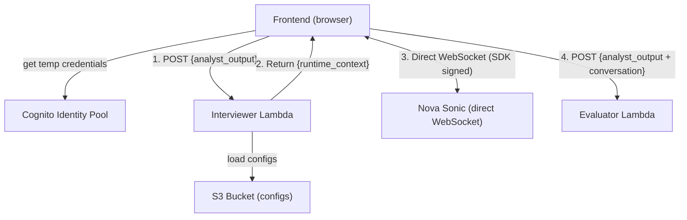

# Design Document: Interviewer Module

## Overview

The Interviewer module is a single Lambda that builds a runtime context for Nova Sonic from the Analyst output + S3 configs.

The frontend connects directly to Nova Sonic using the Bedrock JS SDK with Cognito Identity Pool credentials. No proxy server, no signing Lambda — the SDK handles WebSocket signing internally.

### Design Goals

- **Simple**: One Lambda + direct WebSocket via SDK. No containers, no proxy servers.
- **Secure**: Cognito Identity Pool provides scoped temporary credentials. No raw AWS keys in the browser.
- **Stateless**: No database — frontend holds all state.
- **Configurable**: Interview format and behavior defined in S3, changeable without redeploy.

## Architecture



**Steps 1–2**: Interviewer Lambda (context building)
**Step 3**: Frontend connects directly to Nova Sonic using Bedrock SDK + Cognito credentials
**Step 4**: Frontend sends results to Evaluator

## Infrastructure

| Resource | Value |
|----------|-------|
| Region | `us-east-1` |
| Runtime | Python 3.12 |
| Nova Sonic Model | `amazon.nova-2-sonic-v1:0` |
| S3 Bucket | `cic-mock-interview-configs-002859476624` |
| Structure Key | `interview_structure.json` |
| Profile Key | `student_interview_profile.json` |
| Cognito Identity Pool | `us-east-1:be3da380-d032-46f4-b4a2-85846a61bc52` |
| Lambda Invocation | AWS SDK `LambdaClient.invoke()` |
| Voice Connection | Frontend → Nova Sonic via `@aws-sdk/client-bedrock-runtime` |

## Interviewer Lambda

### Module Structure

```
backend/functions/interviewer/
  __init__.py
  handler.py            # Lambda entry point
  validation.py         # Input validation
  config_loader.py      # S3 fetch for interview configs
  context_builder.py    # Assembles runtime context string
  .env                  # Environment variables (reference only)
```

### Request Flow

```
Frontend (SDK invoke) → handler.py
  ├─ event has 'body'? → parse JSON (400 if fails)
  └─ no 'body'? → use event as payload
      │
      ▼
  validation.py → analyst_output missing? → 200 + error
      │
      ▼
  config_loader.py → S3 fails? → 200 + error
      │
      ▼
  context_builder.py → assemble runtime_context
      │
      ▼
  handler.py → 200 + {"success": true, "runtime_context": "..."}
```

### Behavioral Instructions (in runtime_context)

- You MUST speak first when the session starts — greet the candidate briefly and ask the first question immediately
- Keep all questions and responses to 1-2 sentences maximum
- Ask one question at a time (no compound questions)
- Do not explain, summarize, or narrate what you are about to do
- Follow the tone specified in the interview profile
- Accept all experience types listed in the interview profile
- Do not invent details not present in the candidate data
- Do not give feedback or score answers during the interview
- Do not ask the candidate to rate themselves
- Signal transitions between interview points briefly
- Stop gracefully when the session ends

## Nova Sonic Connection (Frontend)

The frontend uses the Bedrock JS SDK (`@aws-sdk/client-bedrock-runtime`) with Cognito credentials to connect directly to Nova Sonic. The SDK handles SigV4 WebSocket signing internally.

### Event Protocol

**Setup:**
1. `sessionStart` — inference config + turn detection
2. `promptStart` — audio/text output formats + voice
3. `contentStart` (SYSTEM) → `textInput` (runtime_context) → `contentEnd`
4. Send silence + `contentEnd` — triggers Nova to speak first

**Each turn:**
5. `contentStart` (USER/AUDIO) → `audioInput` (repeated) → `contentEnd`
6. Nova responds: `audioOutput` + `textOutput`

**End:**
7. `promptEnd` → `sessionEnd`

### Audio Specs

| | Input (mic → Nova) | Output (Nova → speakers) |
|---|---|---|
| Format | PCM 16-bit mono | PCM 16-bit mono |
| Sample rate | 16,000 Hz | 24,000 Hz |
| Encoding | base64 | base64 |

## Data Models

### Lambda Input

```json
{ "analyst_output": { "...per contracts/analyst_output.json..." } }
```

### Lambda Output (Success)

```json
{"statusCode": 200, "body": "{\"success\": true, \"runtime_context\": \"<string>\"}"}
```

### Lambda Output (Error)

```json
{"statusCode": 200, "body": "{\"success\": false, \"error_message\": \"...\"}"}
```

## Environment Variables

| Variable | Value |
|----------|-------|
| `S3_BUCKET` | `cic-mock-interview-configs-002859476624` |
| `INTERVIEW_STRUCTURE_KEY` | `interview_structure.json` |
| `INTERVIEW_PROFILE_KEY` | `student_interview_profile.json` |

## Error Handling

| Scenario | Status | Message |
|----------|--------|---------|
| Body not valid JSON | 400 | "Request body is not valid JSON" |
| analyst_output missing | 200 | "analyst_output is required..." |
| S3 fails | 200 | includes config name |
| Unhandled exception | 500 | exception description |

## Deployment

```bash
(cd backend/functions/interviewer && zip -r ../../../interviewer.zip . \
  -x ".env" "tests/*" "__pycache__/*" "*.pyc")
aws lambda update-function-code \
  --function-name mock-interview-interviewer \
  --zip-file fileb://interviewer.zip \
  --region us-east-1
```
